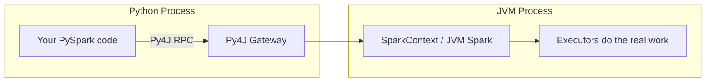

# Module 00 — Setup & Environment

Spark runs on the JVM. PySpark is a Python wrapper (via **Py4J**) around that JVM process.
That single fact explains almost every setup headache you'll ever hit: **you need a working
Java installation**, not just Python.



We'll set up **three** ways to run PySpark. You're learning on **local install**, but recognizing
the other two matters for real jobs — interviewers ask "how have you run Spark?" and "local
install only" is a weaker answer than "local for dev, Docker for parity testing, Databricks/EMR
for production."

| Option | When it's used in the real world | Setup effort |
|---|---|---|
| **Local install (pip)** | Day-to-day development, learning, small data, unit tests | Low — this guide |
| **Docker** | Reproducing a specific cluster's Spark/Java version exactly, CI | Low-medium |
| **Databricks Community Edition** | Closest to a real managed cluster, notebooks, free tier | Medium (signup) |

---

## Option A — Local Install (what we'll use for this course)

### 1. Prerequisites

- **A real JDK — Java 11 or 17** (Spark 3.5.x also supports 8, but a plain **JRE** is not
  enough on Windows — see the gotcha below).
- **Python 3.9–3.11.** PySpark 3.5.x officially claims 3.12 support, but see the confirmed
  gotcha below — 3.11 is the safe choice for this course.

Check what you have:

```bash
java -version
python --version
```

> **Windows note:** if you have multiple Python installs (the Microsoft Store stub, a real
> installer version, etc.), use the **py launcher** to pick one explicitly:
> `py -3.11 -m venv .venv`

### 2. Create an isolated environment

Never `pip install` PySpark globally — you want per-project control over versions, since
different course modules (and different real jobs) may pin different Spark versions.

```bash
# from the repo root
py -3.11 -m venv .venv          # Windows, explicit Python 3.11
# python3.11 -m venv .venv      # macOS/Linux equivalent

# activate it
.venv\Scripts\activate          # Windows (cmd/PowerShell)
# source .venv/bin/activate     # macOS/Linux

pip install --upgrade pip
pip install -r requirements.txt
```

> **⚠️ If your project path contains spaces (like this repo's parent folder,
> "Pyspark for data engineers"):** create the venv **outside** that path instead, e.g.
> `py -3.11 -m venv C:\venvs\pyspark-course`, then activate it with its full path
> (`C:\venvs\pyspark-course\Scripts\activate`). See the first gotcha below for why.

### 3. Set JAVA_HOME (and HADOOP_HOME, optional)

PySpark needs to find a JDK's `bin/java`. Set `JAVA_HOME` for your current session, or
persist it for future sessions:

```powershell
# current session only
$env:JAVA_HOME = "C:\path\to\your\jdk"

# persisted for future sessions (no admin rights needed)
setx JAVA_HOME "C:\path\to\your\jdk"
```

Optional but recommended on Windows: without `HADOOP_HOME` set to a folder containing
`winutils.exe`/`hadoop.dll`, you'll see a harmless-looking
`WARN Shell: Did not find winutils.exe` on every run, and some file-write operations
(covered in Module 02) can behave oddly. See the gotcha table below for the fix.

### 4. Verify

```bash
python 00-setup/verify_install.py
```

Expected output: a Spark version string, a small printed table, and no stack traces.

### Windows gotchas (all three of these were hit and fixed while building this course — they are real, not hypothetical)

| Symptom | Root cause | Fix |
|---|---|---|
| `JAVA_GATEWAY_EXITED`, sometimes preceded by a stray `data was unexpected at this time.` | PySpark launches `spark-submit.cmd` internally. That batch script — and Windows `cmd.exe` in general — breaks on **spaces** (and worse, **parentheses**, e.g. a Java path under `Program Files (x86)`) anywhere in the invoked path. Your **venv's** location is what matters, since PySpark's bundled Spark distribution lives inside `site-packages/pyspark` under whatever venv you created. | Create the venv at a path with **no spaces and no parentheses**. Also avoid JDKs installed under `Program Files (x86)`. |
| `Python worker failed to connect back` / a stray `Python was not found; run without arguments to install from the Microsoft Store...` line | Spark's executors spawn Python workers by invoking the bare command `python` — which on Windows resolves to the **Microsoft Store alias stub**, not your venv, unless you say otherwise. | Set `PYSPARK_PYTHON` and `PYSPARK_DRIVER_PYTHON` to your venv's exact `python.exe` path. `verify_install.py` already does this automatically via `sys.executable` — copy that pattern into your own scripts. |
| `Python worker exited unexpectedly (crashed)` with a `java.io.EOFException`, **no Python traceback at all** | A real, observed incompatibility between **PySpark 3.5.3's worker process and Python 3.12 on Windows** — the worker dies before it can report why. | Use **Python 3.11** for the venv. This fully resolved it in testing; 3.9/3.10 should also be safe. |
| `WARN Shell: Did not find winutils.exe ... HADOOP_HOME and hadoop.home.dir are unset` | Spark bundles Hadoop's client libraries, which expect Hadoop's native Windows shims (`winutils.exe`, `hadoop.dll`) for filesystem operations, even for purely local runs. | Download `winutils.exe` + `hadoop.dll` matching your bundled Hadoop version (check `pyspark/jars/hadoop-client-api-*.jar` for the version) from a trusted community mirror (search `cdarlint/winutils` or `kontext-tech/winutils` on GitHub — well-known, widely-used sources for these), place them in `<somewhere>\hadoop\bin\`, and set `HADOOP_HOME` to `<somewhere>\hadoop`. |
| `Py4JJavaError` on first action, wall of JVM stack trace | This is Spark surfacing a **real error** from inside your transformation — the noise is just JVM stack frames. | Scroll to the **first** `Caused by:` line; that's your actual bug. |
| Works in notebook, fails in script (or vice versa) | Notebook kernel may point at a different Python/venv than your terminal. | Confirm `where python` (in your active shell) matches the interpreter your notebook kernel reports. |
| Any **write** (`.write.parquet(...)`, `partitionBy(...)`, etc.) throws `UnsatisfiedLinkError: ... NativeIO$Windows.access0`, but only when env vars were set from **Git Bash** (`export ...`) rather than PowerShell | Git Bash/MSYS auto-translates path-like environment variables — especially `PATH` — and can mis-translate an already-Windows-style path (e.g. `C:/Users/you/tools/...`) into a mangled, nonexistent path. The JVM then finds a *different*, unintended `hadoop.dll` somewhere else on the corrupted `PATH`, which doesn't implement the native method Spark's write-commit path needs. Reads don't exercise this code path, so this only shows up on writes. (Confirmed while building Module 02 — this looked exactly like a `winutils` version mismatch until testing the same binaries from clean PowerShell proved otherwise.) | Set `JAVA_HOME`/`HADOOP_HOME`/`PATH` in **PowerShell** (as this guide does throughout), not Git Bash, when running real PySpark work on Windows. |

Once you've hit these once and fixed them, they don't come back — but they cost real hours if
you don't know they exist, which is exactly why they're documented here instead of left for you
to rediscover.

---

## Option B — Docker

Useful when you need to **match a specific cluster's Spark + Java + Python version exactly**,
or want a clean environment without touching your machine.

```bash
docker run -it --rm -p 4040:4040 apache/spark-py:v3.5.3 /opt/spark/bin/pyspark
```

- `-p 4040:4040` exposes the **Spark UI** in your browser at `http://localhost:4040` while a job
  runs — this is the single most useful debugging tool in Spark (job/stage/task timelines, SQL
  query plans, storage/cache info). We'll use it heavily starting in the Performance Tuning module.
- To run one of this repo's scripts inside the container, mount the repo:
  ```bash
  docker run -it --rm -v "$(pwd):/workspace" -w /workspace apache/spark-py:v3.5.3 \
    /opt/spark/bin/spark-submit 00-setup/verify_install.py
  ```

## Option C — Databricks Community Edition

Free, browser-based, closest to what a production managed cluster feels like (cluster configs,
notebooks, job scheduling UI). Good for later modules (Delta Lake, Structured Streaming, Jobs).

1. Sign up at the Databricks Community Edition signup page (search "Databricks Community Edition"
   — sign-up flows change often enough that a fixed link here would likely rot).
2. Create a cluster (single-node "Personal Compute" is free-tier friendly).
3. Create a notebook, attach it to the cluster — `spark` is already available as a global
   variable, no `SparkSession.builder` needed.
4. Any code in this course written as a plain script can be pasted directly into a Databricks
   notebook cell; just skip the `SparkSession.builder...getOrCreate()` line since `spark` already
   exists.

We'll call out Databricks-specific behavior (e.g. `dbutils`, DBFS paths, cluster autoscaling)
explicitly in later modules rather than assuming you're on it by default.

---

## Next

Once `verify_install.py` runs cleanly, move to [`01-fundamentals`](../01-fundamentals/README.md).
