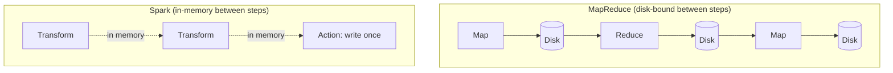
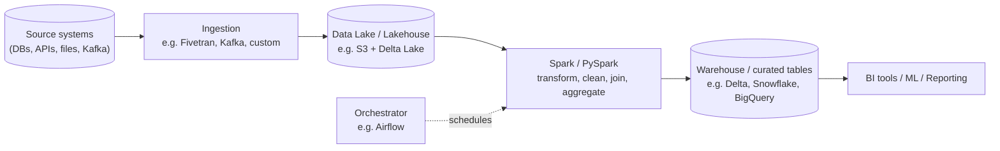

# Lesson 1 — What Spark Is, and Why It Exists

## The problem Spark solves

A single machine has a ceiling: CPU cores, RAM, disk I/O. Pandas, plain SQL, plain Python — all
of them assume your data and your working set fit on one machine. That's fine until it isn't:
a 500 GB table, a join across two 100M-row tables, a nightly batch job that touches years of
history. At that point you have two choices:

1. Buy a bigger machine (vertical scaling) — has a hard ceiling and gets very expensive.
2. Spread the work across many machines (horizontal scaling) — this is what Spark does.

**Apache Spark is a distributed computation engine.** You describe *what* you want computed
(read this data, filter it, join it, aggregate it, write it), and Spark figures out *how* to
split that work across many machines, run it in parallel, and combine the results — including
handling machine failures, redistributing data, and retrying failed work, all invisibly to you.

## Why not just use Hadoop MapReduce?

Spark exists because of a specific frustration with MapReduce (the framework it displaced):
MapReduce writes intermediate results to **disk** between every step. Spark keeps intermediate
data **in memory** across steps whenever possible, which is why it's commonly cited as
10-100x faster for iterative workloads (machine learning, multi-step ETL, anything that touches
the same data more than once). It also has one unified API (batch, SQL, streaming, ML, graph)
instead of needing separate tools glued together.

## Where Spark actually fits in a company's data stack

You will almost never run Spark standalone in a real job. It's typically one piece:

Spark's job in this picture is almost always the **transform** step: taking raw, messy data and
turning it into clean, modeled, aggregated tables other systems consume. That's what "data
engineering with PySpark" means day-to-day — not exotic distributed-systems trivia, but writing
correct, maintainable, performant transformations that run on a schedule, on data that grows
every day, without falling over.

## Why PySpark specifically (not Scala/Java Spark)

Spark itself is written in Scala and runs on the JVM. PySpark is the Python API — your Python
code doesn't execute the DataFrame operations itself, it **describes** them, and Py4J ships that
description to the JVM, which does the actual distributed execution (more on this in the next
lesson). This matters practically:

- **DataFrame/SQL operations**: run at native Spark (JVM) speed — your Python code is just
  building an execution plan, not running row-by-row Python. No performance penalty vs Scala.
- **UDFs (user-defined functions) in plain Python**: *do* pay a real performance cost, because
  data has to be serialized out of the JVM into a Python process and back. We cover exactly when
  this matters (and how to avoid it with Pandas UDFs) in Module 08.

The takeaway for now: **prefer built-in DataFrame/SQL functions over custom Python UDFs**
whenever one exists. This single habit prevents most PySpark performance complaints you'll see
in the real world, and we'll return to it repeatedly.

## When *not* to reach for Spark

Professional judgment matters more than tool enthusiasm. Spark has real overhead (JVM startup,
task scheduling, network shuffle) that makes it **slower than pandas for small data.** If your
dataset fits comfortably in memory on one machine (roughly: a few GB, depends on your machine),
plain pandas/Polars/DuckDB will usually be faster and simpler. Reach for Spark when:
- Data doesn't fit in memory on one machine, or won't for much longer (growth).
- You need fault-tolerant, distributed processing across a cluster.
- You're already in a Spark-based platform (Databricks, EMR) and want consistency with the rest
  of the org's pipelines.

Being able to say this out loud in an interview — knowing the tool's limits, not just its
features — is a strong signal of seniority.

---
**Next:** [Lesson 2 — Architecture Deep Dive](02-architecture-deep-dive.md)
