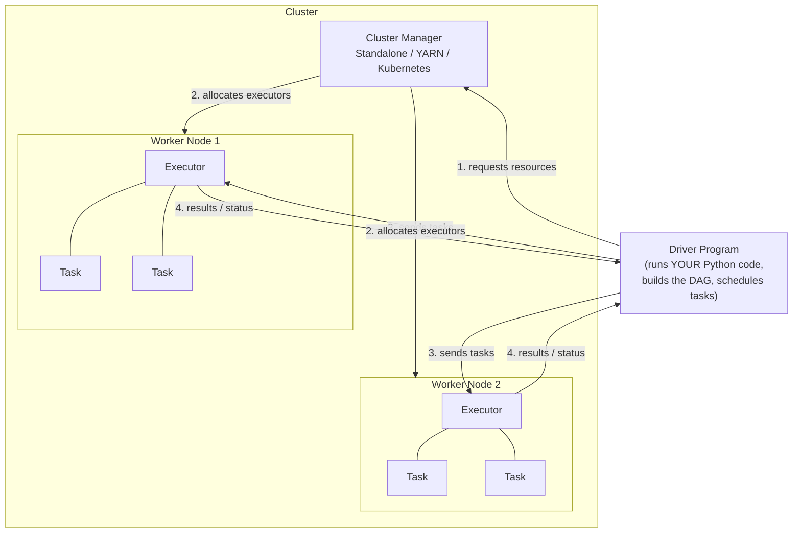
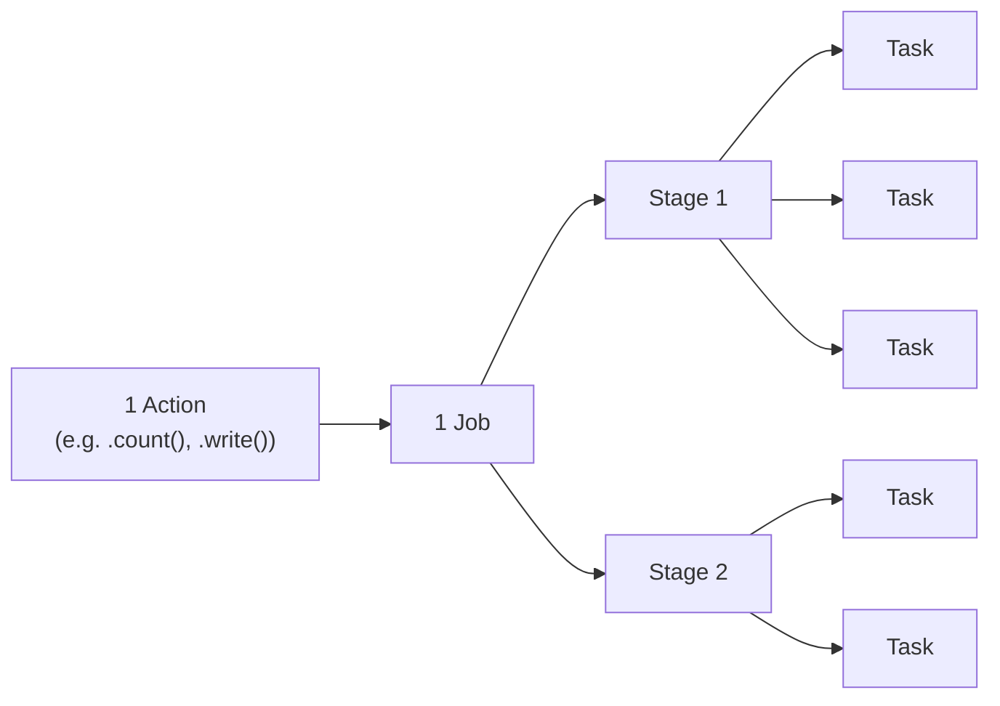
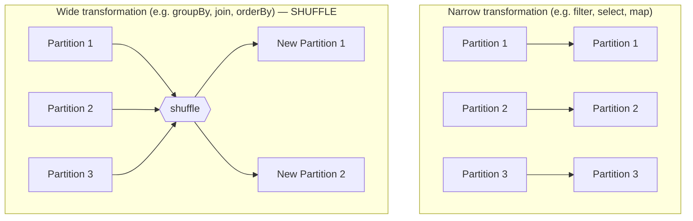

# Lesson 2 — Architecture Deep Dive

This is the single most important lesson in the course for building correct intuition. Almost
every "why is my job slow / why did it fail / why does this config matter" question later comes
back to this diagram.

## The big picture: Driver, Executors, Cluster Manager

| Component | What it actually does | Analogy |
|---|---|---|
| **Driver** | Runs your `main()` / script. Builds the logical plan, asks Catalyst to optimize it, splits it into stages/tasks, and **schedules** work — it does not do the heavy data processing itself. | The project manager: plans the work, hands out assignments, tracks progress. |
| **Cluster Manager** | Decides which physical machines run your executors and how many resources (CPU/memory) each gets. Standalone (Spark's own simple manager), YARN (Hadoop ecosystem), or Kubernetes (cloud-native, increasingly the default) are the common ones. | The building manager who assigns you office space. |
| **Executor** | A JVM process on a worker node that actually runs tasks and holds cached data in memory. Each executor runs many tasks, typically one per CPU core, over its lifetime. | The workers actually doing the labor. |
| **Task** | The smallest unit of work — one function applied to one partition of data. | One person doing one unit of the assigned work. |

**In local mode** (`.master("local[*]")`, what you're using for this course), your single
machine plays *all three roles at once* — one JVM process acts as driver and spawns
executor-threads instead of separate processes across a network. This is why local mode is
great for learning and testing logic, but tells you **nothing** about how your job will behave
distributed across a real cluster (see Module 09 for cluster sizing).

## From your code to a distributed job: Jobs, Stages, and Tasks

- **One action** (`.count()`, `.collect()`, `.write()`, ...) triggers **one Job**.
- Spark's **DAG Scheduler** breaks a Job into **Stages**. A new stage boundary is created
  whenever data needs to be **shuffled** (redistributed across the network) — e.g. for a
  `groupBy`, a `join`, or a `repartition`. Operations that *don't* need a shuffle (like `filter`,
  `select`, `withColumn`) get pipelined together into the *same* stage — this is a real
  performance win called **narrow transformation pipelining**.
- Each Stage is split into **Tasks** — one task per data **partition**. Tasks within a stage run
  in parallel, limited by how many CPU cores your executors collectively have.

This is *the* concept behind "why does adding a `groupBy` make my job slower" — a shuffle is a
stage boundary, and shuffles mean writing data to disk/network and re-reading it on the other
side. Nothing is "wrong" — it's inherent to redistributing data across machines. We go deep on
this in Module 06 (Partitioning & Shuffling).

## Narrow vs Wide transformations

This distinction is *the* reason some operations are cheap and others are expensive:

- **Narrow**: each output partition depends on exactly one input partition. No data has to move
  between machines. Cheap, fast, fully parallel with no coordination needed.
- **Wide**: each output partition may depend on data from *many* input partitions (e.g. every row
  with the same `group_by` key must land on the same machine to be aggregated together). This
  requires a **shuffle**: writing data out, redistributing it across the network by key, and
  reading it back in on the receiving side. Expensive, and the single biggest lever for
  performance tuning in Spark.

## Where this leaves you

Correct mental model: your driver builds a plan → the plan is split at shuffle boundaries into
stages → each stage's work is split by partition into tasks → the cluster manager gave you a
pool of executors → tasks run in parallel on those executors, limited by available cores → wide
transformations (shuffles) are where most performance problems live.

You'll see the Spark UI (`http://localhost:4040` while a job is running) visualize exactly this:
Jobs → Stages → Tasks, with timing for each. Open it now while running `verify_install.py` or
any script — click around the "Jobs" and "SQL / DataFrame" tabs. We'll use it heavily starting
in Module 09.

---
**Next:** [Lesson 3 — RDD vs DataFrame vs Dataset](03-rdd-vs-dataframe-vs-dataset.md)
