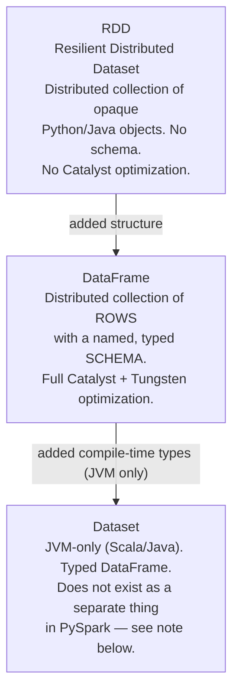
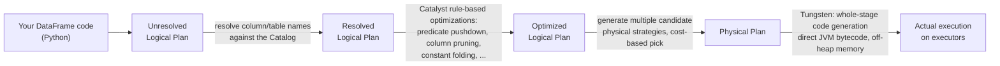

# Lesson 3 — RDD vs DataFrame vs Dataset

## The three APIs



| | RDD | DataFrame | Dataset |
|---|---|---|---|
| What it holds | Arbitrary distributed objects | Rows with a schema (columns + types) | Typed JVM objects with a schema |
| Optimized by Catalyst? | **No** | **Yes** | **Yes** |
| Available in PySpark? | Yes (low-level, rarely needed) | **Yes — this is what you'll use ~99% of the time** | No (JVM-only; in Python, a DataFrame already *is* effectively `Dataset[Row]`) |
| When to use | Unstructured data, custom partitioning logic, legacy code | Almost always | N/A for PySpark |

**The practical rule for this entire course: use the DataFrame API.** RDDs are covered here so
you recognize them (you'll see RDD references in older codebases, Spark internals, and some
interview questions) but you should not be reaching for them in new PySpark code.

## Why DataFrames are faster: Catalyst + Tungsten

This is the actual technical reason "just use DataFrames" isn't cargo-culting — it's because of
what happens *before* your code ever runs:



- **Catalyst** is Spark SQL's query optimizer. Because a DataFrame operation is *declarative*
  (you say *what* you want, not *how*), Catalyst is free to rewrite your plan into something
  equivalent but faster — pushing filters down to the data source, dropping columns you never
  use, reordering joins, etc. **RDDs skip all of this** because they're just opaque Python
  function calls Spark can't inspect or rewrite.
- **Tungsten** is Spark's physical execution engine — it generates JVM bytecode directly for
  your plan (whole-stage code generation) and manages memory off-heap in a compact binary format,
  avoiding JVM object overhead and garbage collection pauses.

**The concrete implication:** the exact same logical operation, written as an RDD `.map()`/
`.filter()` chain vs. a DataFrame `.select()`/`.filter()` chain, can differ by an order of
magnitude in performance — not because RDDs are "bad," but because Spark can't optimize what it
can't see inside.

## Seeing it yourself: `.explain()`

Run this (we'll build full intuition for reading these plans in Lesson 5):

```python
df = spark.read.csv("data/employees.csv", header=True, inferSchema=True)
result = df.filter(df.department == "Engineering").select("name", "salary")
result.explain(True)  # True = show all 4 plan stages from the diagram above
```

You'll see four labeled plans print: `== Parsed Logical Plan ==`, `== Analyzed Logical Plan ==`,
`== Optimized Logical Plan ==`, `== Physical Plan ==`. Notice how the optimized plan already
pushes the filter as close to the data read as possible — that's Catalyst, not you, making your
code faster than it looks like it should be.

## When you'd actually still reach for an RDD

Rare in day-to-day data engineering, but real cases exist:
- Processing genuinely unstructured data that doesn't fit rows/columns (e.g. raw binary blobs,
  custom parsing before you have a schema).
- Needing very fine-grained control over data partitioning for a custom algorithm.
- Some older MLlib APIs and legacy codebases still expose RDDs directly.

You can always get an RDD out of a DataFrame (`df.rdd`) if you truly need to drop down — but
doing so **loses all Catalyst optimization** for anything downstream of that point, so treat it
as an escape hatch, not a default.

---
**Next:** [Lesson 4 — SparkSession and Your First Program](04-sparksession-and-first-program.md)
