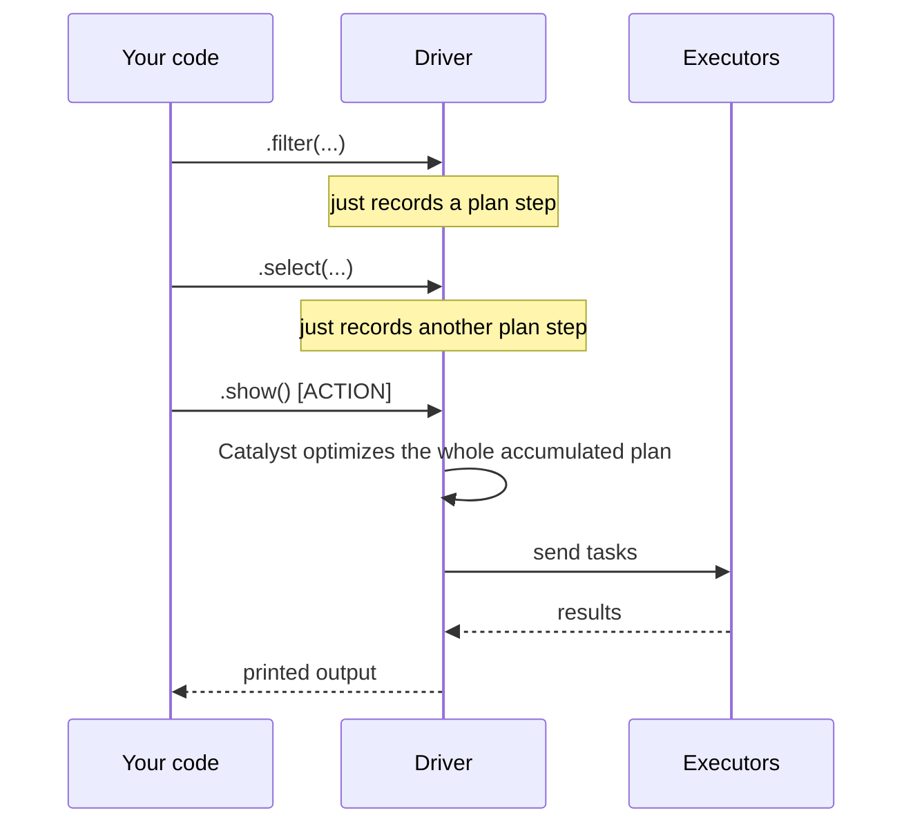

# Lesson 5 — Lazy Evaluation and Execution Plans

## Transformations vs Actions

This is the most important habit-forming distinction in Spark:

- **Transformations** (`.select()`, `.filter()`, `.withColumn()`, `.groupBy()`, `.join()`, ...)
  are **lazy** — calling them does **no computation at all**. They just add a step to a plan.
- **Actions** (`.show()`, `.count()`, `.collect()`, `.write.*()`, `.take()`, ...) are what
  actually trigger Spark to execute the accumulated plan and produce a result.

```python
df = spark.read.csv("data/employees.csv", header=True, inferSchema=True)
filtered = df.filter(df.department == "Engineering")   # NOTHING has executed yet
selected = filtered.select("name", "salary")             # still nothing has executed
selected.show()                                          # <-- THIS triggers the actual job
```



## Why laziness is a deliberate design choice, not an accident

Because Spark waits until an action to do anything, it gets to see your **entire** chain of
transformations *before* deciding how to execute any of it. That's what lets Catalyst do
whole-plan optimizations — e.g. pushing a `.filter()` down before a `.select()` even if you
wrote them in the "wrong" order, or skipping columns entirely if they're never used downstream.
An eager, run-each-line-immediately system couldn't do this, because it wouldn't yet know what
comes next.

**The practical consequence for you:** don't fear chaining many transformations together for
readability — Spark doesn't execute them one at a time, so a long, clear chain of `.filter()` /
`.withColumn()` / `.select()` calls costs you nothing extra versus cramming logic into fewer
lines. Optimize for readability; Catalyst optimizes for performance.

## The other practical consequence: errors show up late

Because nothing runs until an action, a bug in a transformation (e.g. referencing a column that
doesn't exist) can sometimes surface far from the line that caused it — at the `.show()` call at
the bottom of your script, not the `.select()` that had the typo. When debugging, don't assume
the error is "at" the action line; trace back through the transformation chain above it.

## Reading `.explain()`

```python
df = spark.read.csv("data/employees.csv", header=True, inferSchema=True)
result = (
    df.filter(df.department == "Engineering")
      .select("name", "salary")
)
result.explain()          # physical plan only (the default, usually all you need day-to-day)
result.explain("extended") # all 4 stages: parsed / analyzed / optimized / physical
```

Typical physical plan output for the above:

```
== Physical Plan ==
*(1) Project [name#8, salary#10]
+- *(1) Filter (isnotnull(department#9) AND (department#9 = Engineering))
   +- FileScan csv [name#8,department#9,salary#10] Batched: false, ...
      PushedFilters: [IsNotNull(department), EqualTo(department,Engineering)]
```

Read it **bottom to top** (data flows upward through the plan):
1. `FileScan csv` — reads the file. Notice `PushedFilters` — Catalyst pushed your `.filter()`
   condition all the way down to the file scan itself where possible, so fewer rows are even
   read into memory. This is **predicate pushdown**, one of Catalyst's key optimizations.
2. `Filter` — applies the department condition (a safety-net re-check; some data sources can't
   fully push down the filter, so Spark still applies it in-memory too).
3. `Project` — keeps only the `name` and `salary` columns (**column pruning** — the other
   columns in the CSV are never even materialized).

The `*(1)` prefix means **whole-stage code generation** is active — Tungsten fused these
operators into a single generated function rather than interpreting them one row at a time.

## `.count()` vs `.show()` vs `.collect()` — pick the right action

| Action | Returns | Danger |
|---|---|---|
| `.count()` | A single number | Safe at any scale — Spark counts distributed, never pulls rows to the driver |
| `.show(n)` | Prints `n` rows (default 20) | Safe — only pulls a small sample to the driver |
| `.collect()` | **All rows**, as a Python list, in driver memory | **Can crash your driver (OutOfMemory)** on anything but small data — never call on a large DataFrame |
| `.take(n)` | First `n` rows as a Python list | Safe — like `.show()` but returns data instead of printing |

**Rule of thumb:** never call `.collect()` out of habit. Ask "do I actually need every row back
in the driver's Python process?" — usually the answer is no, and `.show()`, `.count()`, or
writing the result out with `.write.*()` is what you actually want.

---
**Module 01 lessons complete.** Head to [`exercises/`](exercises/) before checking
[`solutions/`](solutions/), then take the [quiz](quiz.md).
