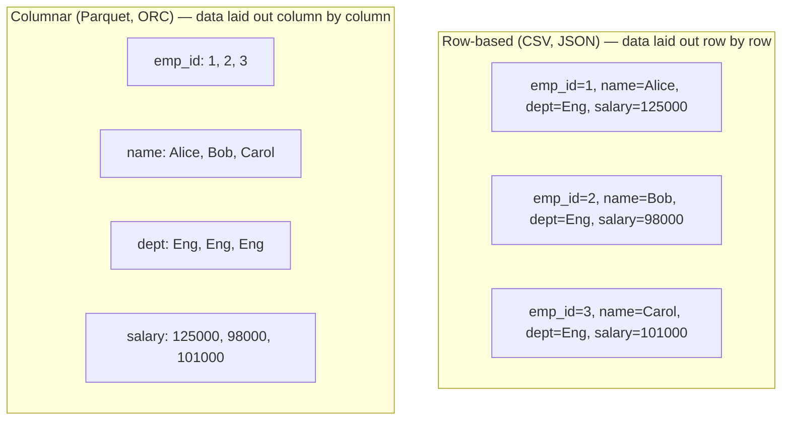

# Lesson 2 — File Formats Deep Dive

The file format you choose affects performance, storage cost, and what optimizations Spark can
even attempt. This is a design decision, not a default to leave alone.

## Row-based vs columnar storage



This single layout difference explains most of the practical tradeoffs:

- **Columnar formats compress far better**, because similar values (all salaries, all
  departments) sit next to each other — repeated strings like `"Engineering"` compress
  extremely well when they're adjacent, much less so scattered across different rows' fields.
- **Columnar formats support real column pruning at the storage layer.** If you only need the
  `name` column, a columnar reader can skip reading the other columns' bytes entirely from disk.
  A row-based reader has to read and parse every full row even if you only want one field out of
  it — the data for other columns is interleaved right next to what you wanted.
- **Row-based formats are naturally better for streaming/appending** individual records, and for
  formats humans need to read directly (CSV in a spreadsheet, JSON from an API).

Proof of the column-pruning claim — verified by writing `employees.csv` as Parquet and reading
back only the `name` column:

```
== Physical Plan ==
*(1) ColumnarToRow
+- FileScan parquet [name#42] ... ReadSchema: struct<name:string>
```

`ReadSchema: struct<name:string>` confirms Spark only materialized the `name` column from disk —
`department`, `salary`, and everything else were never even read. CSV cannot do this; it has to
parse every field of every row to get at any one of them.

## Format comparison

| Format | Type | Compression | Splittable | Schema stored in file? | Schema evolution | Best for |
|---|---|---|---|---|---|---|
| **CSV** | Row-based, text | Poor (needs external gzip etc.) | Only if uncompressed | No | None — you manage it | Interop with non-Spark tools, human-editable data, small exports |
| **JSON** | Row-based, text | Poor | Only if uncompressed, one-object-per-line | No | None — you manage it | Semi-structured/nested data, API payloads |
| **Parquet** | Columnar, binary | Excellent (built-in, per-column) | Yes | **Yes** | Good — additive changes handled via `mergeSchema` (Lesson 5) | The default choice for analytical workloads — this is what you should reach for unless you have a specific reason not to |
| **ORC** | Columnar, binary | Excellent | Yes | Yes | Good | Very similar to Parquet; more common in the Hadoop/Hive ecosystem than in cloud-native/Databricks stacks |
| **Avro** | Row-based, binary | Good | Yes | Yes (schema travels with data) | **Excellent** — designed specifically for schema evolution | Streaming pipelines (e.g. Kafka payloads), row-by-row processing, when producers/consumers evolve independently |

**Default recommendation for this course and for real pipelines: Parquet**, unless you have a
specific reason otherwise (interop with a tool that needs CSV, streaming a row at a time with
Avro, or an existing Hive/ORC-based warehouse). This is also what Delta Lake (Module 11) is built
on top of.

## A real, honest caveat: format overhead at small scale

Parquet's advantages come from column-level metadata and compression — which has fixed overhead
that only pays off once you have enough rows to amortize it. Verified on our 15-row
`employees.csv` (692 bytes):

```
CSV size: 692 bytes
Parquet size: 2221 bytes
```

**Parquet was over 3x larger than CSV here.** This isn't a mistake — it's the truth about small
data: Parquet's per-file/per-column-chunk metadata (min/max stats, encoding info, footer) is a
fixed cost that dominates when there's barely any actual data to compress. At real-world scale
(thousands to billions of rows), that same metadata becomes a rounding error next to the
compression savings, and Parquet wins decisively. **Don't take format advice on faith — the right
lesson here is to benchmark on data that resembles your actual production scale, not a toy file.**

## Reading each format

```python
# CSV
df = spark.read.csv("data/employees.csv", header=True, schema=my_schema)

# JSON — default expects one JSON object per line ("JSON Lines" / JSONL)
df = spark.read.json("data/employees.json")

# JSON — a pretty-printed array spanning multiple lines needs multiLine
df = spark.read.option("multiLine", "true").json("data/employees_pretty.json")

# Parquet — schema comes from the file itself, no schema= needed
df = spark.read.parquet("path/to/parquet/dir")

# ORC
df = spark.read.orc("path/to/orc/dir")
```

**The `multiLine` option is a real, common trap**, verified here: reading a pretty-printed JSON
array *without* `multiLine=True` doesn't error immediately — it silently tries to parse **each
line** as its own separate JSON object, fails on every single one (since no line alone is valid
JSON), and produces a DataFrame containing nothing but a `_corrupt_record` column:

```
root
 |-- _corrupt_record: string (nullable = true)

count: 26        # one "record" per line of the file — every one of them malformed
```

With `multiLine=True`, the same file reads correctly into the real schema. Match the option to
how the file is actually formatted — don't assume.

---
**Next:** [Lesson 3 — Reading Data Like a Pro](03-reading-data-like-a-pro.md)
