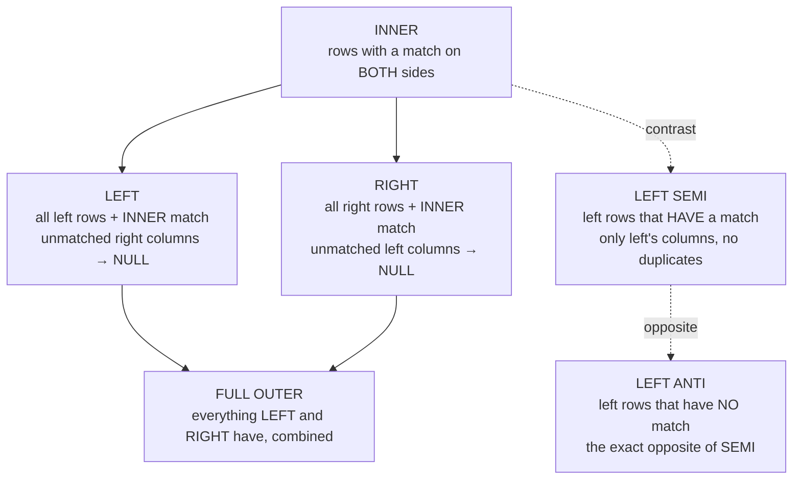

# Lesson 1 — The Six Join Types

`employees.csv` (15 rows) and `orders.csv` (15 rows) are joined on `emp_id` throughout this module.
Two facts about this specific data make every join type actually show something different:
**11 of the 15 employees have never placed an order**, and **one order (`order_id = 1013`) was
placed under `emp_id = 999`, which doesn't exist in `employees.csv`** — a data-quality issue you'll
find in real systems (a since-deleted employee, a bad import, a foreign key that was never
enforced).



## INNER: only rows present on both sides

```python
employees.join(orders, on="emp_id", how="inner").count()
```

```
14
```

15 orders exist, but the `emp_id = 999` order has no matching employee, so it's dropped —
`inner` (the default `how` if you omit it) only keeps rows where the join key matched on both
sides.

## LEFT: every employee, matched order columns or NULL

```python
employees.join(orders, on="emp_id", how="left").count()
```

```
25
```

14 matched rows (same as `inner`) plus one row *per unmatched employee* — 11 of them — each with
every `orders` column as `NULL`. An employee with 3 orders produces 3 output rows here (one per
order), same as `inner` would for their matches; `left` only adds rows for the ones with *zero*
matches, it doesn't collapse the ones with multiple.

```python
employees.join(orders, on="emp_id", how="left") \
    .filter(col("order_id").isNull()).select("name").distinct().orderBy("name").show()
```

```
+--------------+
|          name|
+--------------+
|    Alice Chen|
|    Bob Okafor|
|   Carol Nunez|
|     Grace Lin|
|    Hassan Ali|
|   Ines Moreau|
|   Jamal Smith|
|  Liam O'Brien|
|   Mona Farouk|
|Noah Bergstrom|
|   Olivia Tran|
+--------------+
```

## RIGHT: every order, matched employee columns or NULL — the orphan row surfaces here

```python
employees.join(orders, on="emp_id", how="right").count()
```

```
15
```

All 15 orders survive, including the orphan. Its employee-side columns come back `NULL`:

```python
employees.join(orders, on="emp_id", how="right") \
    .filter(col("name").isNull()).show()
```

```
+------+----+----------+------+---------+----------+--------+--------+--------+------+----------+------+
|emp_id|name|department|salary|hire_date|manager_id|order_id| product|category|amount|order_date|region|
+------+----+----------+------+---------+----------+--------+--------+--------+------+----------+------+
|   999|NULL|      NULL|  NULL|     NULL|      NULL|    1013|Widget A|Hardware| 250.0|2023-06-15| South|
+------+----+----------+------+---------+----------+--------+--------+--------+------+----------+------+
```

**This is exactly the query you'd run to find referential-integrity problems**: a `RIGHT` (or
`LEFT` from the other table's perspective) join filtered to `WHERE <parent-side key> IS NULL`
surfaces every child row whose parent doesn't actually exist.

## FULL OUTER: everything, from both directions, at once

```python
employees.join(orders, on="emp_id", how="full").count()
```

```
26
```

14 matched + 11 unmatched employees + 1 unmatched order = 26 — the union of what `left` and
`right` each surface.

## LEFT SEMI: "does a match exist?" — left columns only, no duplication

`left_semi` answers a yes/no membership question without ever bringing in the right side's columns
or duplicating a left row per match — it's the join-based equivalent of the `EXISTS` subquery from
Module 04 Lesson 2:

```python
employees.join(orders, on="emp_id", how="left_semi").orderBy("emp_id").show()
```

```
+------+-------------+----------+-------+----------+----------+
|emp_id|         name|department| salary| hire_date|manager_id|
+------+-------------+----------+-------+----------+----------+
|     4|    David Kim|     Sales|72000.0|2018-05-23|      NULL|
|     5|Elena Petrova|     Sales|68000.0|2022-02-15|         4|
|     6|Farid Haidari|     Sales|75000.0|2021-09-09|         4|
|    11|Katya Ivanova|     Sales|70000.0|2019-12-01|         4|
+------+-------------+----------+-------+----------+----------+
```

Only 4 rows — one per employee who has *any* order, regardless of how many they actually placed —
compare to `inner`'s 14 rows, which would include a row per matching order and therefore duplicate
these same 4 employees' base data.

## LEFT ANTI: the exact opposite of LEFT SEMI

```python
employees.join(orders, on="emp_id", how="left_anti").orderBy("emp_id").select("name").show()
```

```
+--------------+
|          name|
+--------------+
|    Alice Chen|
|    Bob Okafor|
|   Carol Nunez|
|     Grace Lin|
|    Hassan Ali|
|   Ines Moreau|
|   Jamal Smith|
|  Liam O'Brien|
|   Mona Farouk|
|Noah Bergstrom|
|   Olivia Tran|
+--------------+
```

The 11 employees who have never placed an order — identical result to the `NOT EXISTS` correlated
subquery from Module 04 Lesson 3, without the `NOT IN` + `NULL` trap even being a possibility,
because `left_anti` isn't expressed as a list-membership check at all.

**The practical rule:** if you only ever want a yes/no "related row exists" answer, reach for
`left_semi`/`left_anti` (or SQL's `EXISTS`/`NOT EXISTS`) directly instead of doing an `inner`/`left`
join and then `.select()`ing away the right side's columns — it's clearer about intent, and for
`left_anti` specifically, it sidesteps the `NOT IN` NULL trap entirely.

---
**Next:** [Lesson 2 — The Duplicate-Column Trap](02-duplicate-columns.md)
