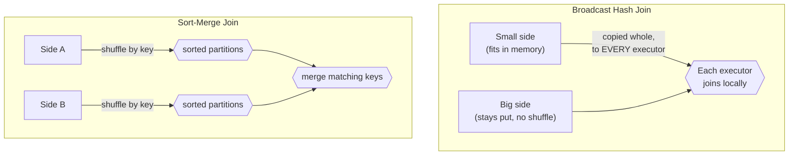

# Lesson 3 — Broadcast vs Sort-Merge Joins

Everything so far has been about what a join *returns*. This lesson is about how Spark actually
*executes* one physically — because the two strategies have wildly different costs, and the wrong
one on a real-sized dataset is a classic source of a job that's mysteriously slow or that runs out
of memory.

## Two physical strategies



- **Broadcast hash join**: the smaller side is copied *in full* to every executor. No shuffle of
  the large side at all — each executor just probes its local copy of the small side against
  whatever big-side partitions it already has. Fast, when the small side actually fits comfortably
  in each executor's memory.
- **Sort-merge join**: both sides get shuffled (redistributed across the network by join key,
  Module 06 covers this shuffle mechanism itself), sorted, and merged. Necessary when neither side
  is small enough to broadcast, but it's the expensive path — every row on both sides moves across
  the network.

## Reading it off `.explain()`

Spark picks automatically based on `spark.sql.autoBroadcastJoinThreshold` (default 10MB) — if a
side's estimated size is under that threshold, it broadcasts it without being asked:

```python
employees.join(orders, on="emp_id", how="inner").explain()
```

```
== Physical Plan ==
AdaptiveSparkPlan isFinalPlan=false
+- Project [...]
   +- BroadcastHashJoin [emp_id], [emp_id], Inner, BuildLeft, false
      :- BroadcastExchange HashedRelationBroadcastMode(...), [plan_id=...]
      :  +- Filter ...
```

Both of these CSVs are tiny, so Spark broadcasts one side automatically — you'll see
`BroadcastHashJoin` and a `BroadcastExchange` in the plan without asking for it. This is exactly
why the join-type examples in Lesson 1 ran instantly with no visible shuffle stage.

## Forcing the choice

Force a broadcast explicitly with the `broadcast()` hint — useful when Spark's size *estimate* is
wrong (common after several transformations, where the true row count is smaller than Spark's
statistics suggest) and you know from context that a side is safe to broadcast:

```python
from pyspark.sql.functions import broadcast

employees.join(broadcast(orders), on="emp_id", how="inner").explain()
# -> BroadcastHashJoin / BroadcastExchange, same as above
```

Force the other direction — sort-merge, even on data this small — by disabling automatic
broadcasting entirely:

```python
spark.conf.set("spark.sql.autoBroadcastJoinThreshold", "-1")
employees.join(orders, on="emp_id", how="inner").explain()
```

```
== Physical Plan ==
AdaptiveSparkPlan isFinalPlan=false
+- Project [...]
   +- SortMergeJoin [emp_id], [emp_id], Inner
      :- Sort [emp_id ASC NULLS FIRST], false, 0
      :  +- Exchange hashpartitioning(emp_id, 8), ENSURE_REQUIREMENTS, [plan_id=...]
      :     +- Filter isnotnull(emp_id)
      +- Sort [emp_id ASC NULLS FIRST], false, 0
         +- Exchange hashpartitioning(emp_id, 8), ENSURE_REQUIREMENTS, [plan_id=...]
            +- Filter isnotnull(emp_id)
```

Verified: with the threshold disabled, the exact same query switches to `SortMergeJoin` with an
`Exchange` (shuffle) on each side, even though the data volume didn't change at all — this is a
config decision Spark made, not something the data forced.

## Why you'd deliberately go either direction

- **Force `broadcast()`** when you're joining a genuinely small reference/dimension table (a
  lookup of ~50 region codes, say) against a large fact table, and Spark's automatic size
  estimate is wrong or too conservative — e.g. right after a `.filter()` that Spark can't estimate
  selectivity for precisely. Skipping the shuffle on the large side is a real, often large win.
- **Avoid a broadcast** (raise or disable the threshold) when the "small" side isn't actually
  small enough to fit comfortably in every executor's memory — broadcasting a side that's too big
  is a classic cause of executor OOM errors, since Spark copies the *entire* side to *every*
  executor, not once total.
- **Never blindly trust the automatic threshold** on a side that went through several
  transformations before the join — Spark's size estimate can be stale or wrong at that point, in
  either direction. If you know the true size, say so explicitly with `broadcast()` (or disabling
  it) rather than hoping the default guesses right.

---
**Next:** [Lesson 4 — Data Skew and Adaptive Query Execution](04-data-skew-and-aqe.md)
