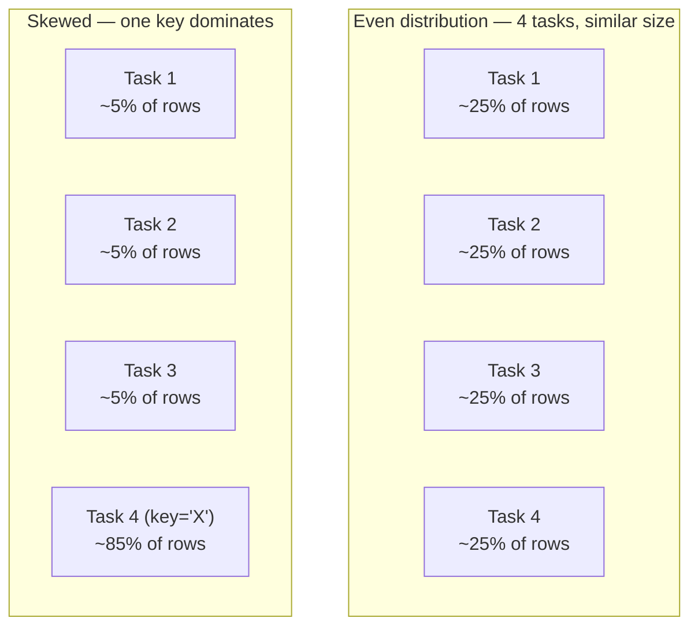

# Lesson 4 — Data Skew and Adaptive Query Execution

This lesson is conceptual rather than run-and-verify — genuine data skew needs a dataset with a
realistically uneven key distribution across millions of rows to actually manifest as a slow task,
which this course's 15-row CSVs can't reproduce. What follows is the mental model you need before
Module 06 (Partitioning & Shuffling) goes deep on diagnosing and fixing it with real tooling.

## What skew actually is

A sort-merge join (Lesson 3) shuffles both sides by join key, so that every row with the same key
lands on the same partition/task. **Skew is what happens when the keys aren't evenly distributed**
— one or a handful of key values account for a hugely disproportionate share of the rows:

Every task in a stage runs in parallel, but **the stage doesn't finish until its slowest task
does**. If 85% of your join's rows share one key (a wildly popular product, a default/placeholder
customer ID, a `NULL`-like sentinel value that snuck past validation), that one task does 17x the
work of its neighbors while everyone else's executor sits idle waiting for it. This is the classic
"why is my job stuck at 199/200 tasks for 20 minutes" symptom.

## Why it hits joins particularly hard

A `groupBy`/aggregation with a skewed key is expensive but bounded — it still only has to
aggregate that one key's rows once. A **join** with a skewed key is worse: if the skewed key
appears heavily on *both* sides of the join, the number of output rows for that key is the
**product** of how many times it appears on each side (every left row with that key pairs with
every right row with that key) — a moderate skew on both sides can blow up into a task producing
far more output rows than either input side had to begin with.

## The mitigation built into modern Spark: Adaptive Query Execution (AQE)

Spark 3.x+ (on by default since 3.2, and active in the 3.5.3 this course uses) includes **Adaptive
Query Execution**, which re-optimizes a query plan mid-execution using real statistics gathered
from completed shuffle stages — including a specific **skew join optimization**
(`spark.sql.adaptive.skewJoin.enabled`, on by default alongside `spark.sql.adaptive.enabled`):
when AQE detects one partition is disproportionately larger than the others after a shuffle, it
automatically splits that oversized partition into several smaller sub-partitions and joins each
piece separately, instead of leaving one task to process the whole skewed key alone.

This doesn't mean skew is now a solved, ignorable problem — it means the *worst* naive failure
mode (one task takes forever, the rest of the cluster idles) has a decent automatic mitigation in
current Spark versions, which older Spark (pre-3.0) genuinely didn't have. You can still hit
skew AQE can't fully absorb (e.g. a single key so dominant that even its split sub-partitions are
each still huge), which is where manual techniques like **salting** (artificially splitting a hot
key into several sub-keys by appending a random suffix, joining on the salted key, then
aggregating back) come in — Module 06 covers diagnosing skew from the Spark UI and salting in
depth, once partitioning and shuffling have been covered properly.

## What to actually do with this lesson right now

You don't have the tooling yet (Module 09 covers the Spark UI in depth) to *observe* skew
first-hand — but recognize the symptom when you see it in a real job: a stage that's nearly done
except for one or two tasks that sit at "running" far longer than the rest, especially right after
a `join` or `groupBy`. That's the signal to suspect the join key's distribution, not to assume the
cluster is just slow.

---
**Next:** [Lesson 5 — NULL Join Keys and the Accidental Cartesian Product](05-null-keys-and-cross-joins.md)
