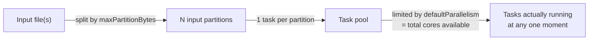

# Lesson 1 — Partitions 101: What They Are and Where They Come From

Module 01 Lesson 2 established that a **Task** is the smallest unit of work — one function applied
to one **partition** of data — and that partitions run in parallel, limited by available cores.
This lesson is about the partition side of that equation specifically: what decides how many
partitions a DataFrame has, at each point in its life.

## Reading a DataFrame's current partition count

```python
employees = spark.read.csv("data/employees.csv", header=True, schema=emp_schema)
employees.rdd.getNumPartitions()
```

```
1
```

One partition — `employees.csv` is a single small file, and Spark's file-based readers create one
input partition per file-split. `.rdd.getNumPartitions()` forces Spark to materialize the physical
plan (same category of action as `.count()` or `.collect()`), which is why it's a real, checkable
number, not a plan-time estimate.

## Where the *input* partition count comes from: file splits

For file-based sources, Spark doesn't create one partition per file blindly — it splits by size,
governed by `spark.sql.files.maxPartitionBytes`:

```python
spark.conf.get("spark.sql.files.maxPartitionBytes")
```

```
'134217728b'
```

That's 128 MiB (verified, this course's PySpark 3.5.3 default). A single file smaller than this
becomes one partition (`employees.csv` is a few hundred bytes, hence the `1` above). A single file
*larger* than this gets split into multiple input partitions automatically — e.g. a 500 MB CSV
would become roughly 4 input partitions, without you doing anything. Many small files, conversely,
each become their own tiny partition unless you explicitly combine them (Module 02 Lesson 4's
small-files problem, from the write side — this is the same problem showing up on the read side).

## Where *local[*]* parallelism comes from: `defaultParallelism`

```python
spark.sparkContext.defaultParallelism
```

```
16
```

In local mode, this equals the number of logical cores `local[*]` picked up on the machine running
this course — it's the ceiling on how many tasks can *actually* run simultaneously, regardless of
how many partitions exist. 200 partitions on a machine with `defaultParallelism = 16` doesn't mean
200-way parallelism; it means 16 tasks run at a time, working through 200 partitions in waves. On a
real cluster, this is the sum of cores across all executors instead of one machine's core count.



## The two partition counts that matter, and when each applies

There are really two separate numbers to keep straight, and conflating them is a common source of
confusion:

- **Input partition count** — decided by file splits (`maxPartitionBytes`) when reading, carried
  forward through narrow transformations (`filter`, `select`, `withColumn` don't change it —
  Module 01's narrow-transformation pipelining applies directly).
- **Post-shuffle partition count** — decided by `spark.sql.shuffle.partitions` (Lesson 3) the
  moment a wide transformation (`groupBy`, `join`, `orderBy`) runs, completely independent of
  whatever the input partition count was.

A `filter()` right after reading `employees.csv` still has 1 partition. A `groupBy()` right after
that same read jumps to whatever `spark.sql.shuffle.partitions` says — Lesson 3 verifies exactly
that jump, and why its default value is the single most impactful thing you didn't know you'd
already been overriding in every script in this course.

---
**Next:** [Lesson 2 — repartition(n, col): Hash Partitioning and Key Colocation](02-repartition-hash-partitioning.md)
