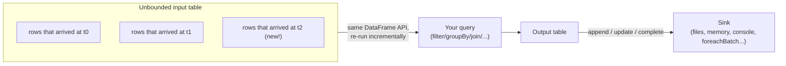

# Lesson 1 — The Structured Streaming Mental Model

Every batch job in Modules 01-09 works on a dataset that's already fully there. Structured
Streaming answers a different question: what if the data keeps arriving? Spark's answer is
deliberately simple — treat the input as a table that keeps growing, and re-run (an incremental,
differential version of) your query every time new rows show up.

## The unbounded table



You write the same `select`/`filter`/`groupBy`/`join` code you already know. Spark's streaming
engine is what's different: instead of running your query once against a fixed input, it re-runs
an incremental version of it every time a **trigger** fires (Lesson 2), processing only the rows
that arrived since the last trigger, and updates the output table according to an **output mode**.

## A real file-source pipeline

No Kafka needed — a directory that files get dropped into is a genuine streaming source. This
mirrors a common real pattern: a landing zone (S3/ADLS/HDFS prefix) that upstream systems write
new files into.

```python
from pyspark.sql.types import StructType, StructField, StringType, IntegerType, DoubleType

schema = StructType([
    StructField("order_id", IntegerType()),
    StructField("customer", StringType()),
    StructField("amount", DoubleType()),
])

stream_df = (
    spark.readStream
    .schema(schema)
    .option("header", "true")   # exactly like a batch CSV read -- easy to forget on a stream
    .csv("/path/to/landing-zone")
)

print(stream_df.isStreaming)   # True
```

**Verified gotcha, easy to trip on:** a streaming CSV read needs `.option("header", "true")`
just like a batch read does — miss it, and the header row from *every* incoming file gets parsed
as a literal data row (`order_id=NULL, customer="customer", amount=NULL`) with no error or warning.
This isn't unique to streaming, but it's an easy detail to drop when you're focused on the new
`readStream` mechanics and forget the ordinary CSV-reading rules from Module 02 still apply.

## You can't just `.show()` it — verified

A streaming DataFrame is a query plan, not materialized data — there's nothing to `.collect()` or
`.count()` yet, because "yet" is the whole point. Spark enforces this explicitly rather than
letting you call an action that would hang forever:

```python
stream_df.count()
```

```
pyspark.errors.exceptions.captured.AnalysisException: Queries with streaming sources must be
executed with writeStream.start();
```

Verified: the exact same error for `.show()`. Every batch action you've used all course
(`.collect()`, `.count()`, `.show()`, `.toPandas()`) is rejected outright on a streaming
DataFrame. The only way to actually run a streaming query is `.writeStream...start()`.

## Starting a query and choosing an output mode

```python
query = (
    stream_df.writeStream
    .format("memory")          # a debugging sink -- registers a queryable temp table
    .queryName("orders_stream")
    .outputMode("append")
    .start()
)

query.awaitTermination(10)     # block for up to 10s, or omit the arg to block forever
spark.sql("select * from orders_stream").show()
query.stop()
```

Verified end to end: a file dropped into the source directory *before* `.start()` is picked up on
the first micro-batch; a file dropped in *while the query is already running* is picked up on the
next trigger, with no restart needed. `query.lastProgress["numInputRows"]` confirms exactly how
many rows each micro-batch actually read.

The **output mode** controls what the sink receives each trigger:

| Mode | What the sink gets | Works with |
|---|---|---|
| `append` (most common) | only the new rows produced since the last trigger | any query without aggregation, or a windowed aggregation with a watermark (Lesson 3) |
| `update` | only the rows whose aggregate value *changed* this trigger | aggregations (`groupBy`, window) |
| `complete` | the *entire* result table, every trigger | aggregations only — impractical for a huge result |

Picking the wrong mode isn't a style choice — Spark refuses at `.start()` time if a mode is
genuinely incompatible with your query (e.g. `append` on an unwatermarked aggregation), which is a
much safer failure than an ambiguous partial result.

## Best-practice callouts

- **Always pin an explicit `schema` on a streaming source.** Batch `inferSchema` re-reads the whole
  file to guess types (Module 02); a streaming source can't do that at all for files that haven't
  arrived yet, so `readStream` doesn't support `inferSchema=True` for file sources in the first
  place — you're required to be explicit here, which is a good habit either way.
- **Use `format("memory")` / `format("console")` only for learning and local debugging.** Neither
  scales or persists sensibly in production — Lesson 4 and 5 cover the sinks (files, `foreachBatch`)
  you'd actually use.
- **Production trap:** a streaming query left running with no monitoring is invisible the moment it
  silently stops making progress (upstream source drained, a transient error auto-retried into a
  stuck state). Lesson 5's `lastProgress`/`recentProgress` pattern is the minimum viable monitoring
  for any stream you'd actually ship.

---
**Next:** [Lesson 2 — Triggers, Verified](02-triggers-verified.md)
