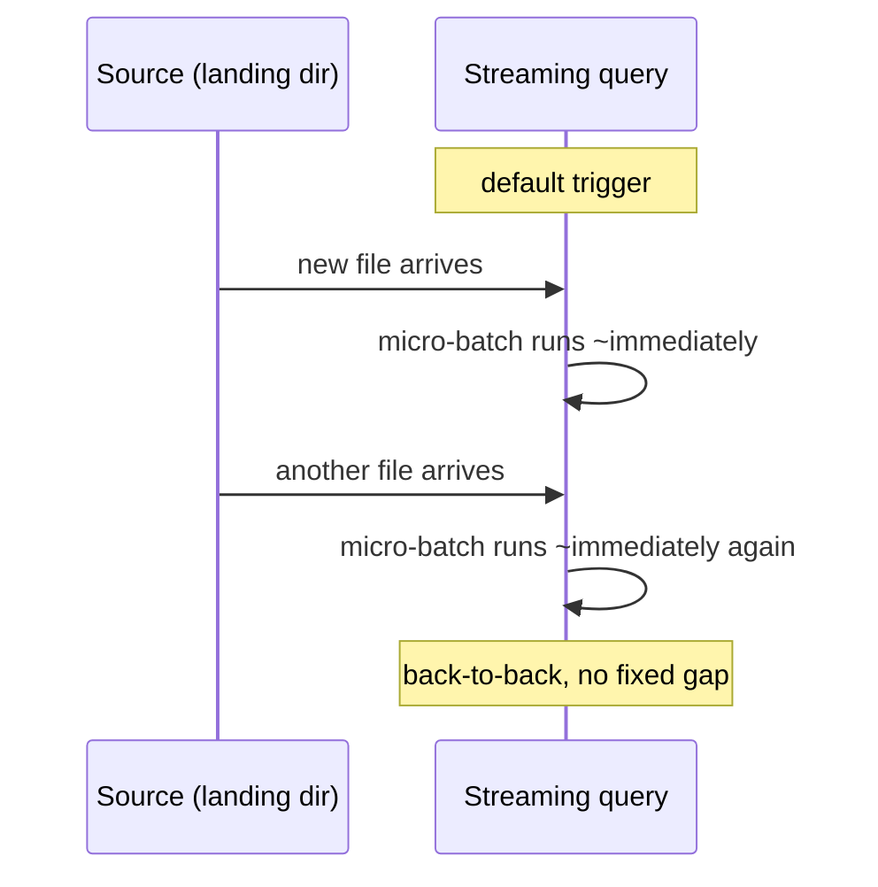

# Lesson 2 — Triggers, Verified

A **trigger** decides when Spark checks the source for new data and runs a micro-batch. Get this
wrong and you either burn cost polling a source that rarely has new data, or add needless latency
to a source that's genuinely bursty. This lesson verifies the three you'll actually use, with real
batch timestamps — not the docs' word for it.



## Default trigger: back-to-back, as fast as possible

No `.trigger(...)` call at all is the default: Spark starts the next micro-batch immediately after
the previous one finishes (if there's new data), with no fixed waiting interval.

```python
query = stream_df.writeStream.format("memory").queryName("t").outputMode("append").start()
```

Verified: dropping 3 files roughly 1.5-2.3 seconds apart produced 3 real micro-batches whose
timestamps tracked the file-arrival gaps almost exactly:

```
batches with actual data = 3
  2026-07-15T09:43:16.486Z numInputRows = 1
  2026-07-15T09:43:18.813Z numInputRows = 1   (+2.3s)
  2026-07-15T09:43:19.704Z numInputRows = 1   (+0.9s)
```

Good for genuinely low-latency needs, but it also means a source that's constantly getting tiny
updates will constantly re-trigger — for many pipelines that's needless overhead for no real
freshness benefit, which is exactly what the next trigger fixes.

## `Trigger.ProcessingTime`: a fixed cadence, verified — not "whenever data shows up"

```python
query = (
    stream_df.writeStream.format("memory").queryName("t")
    .outputMode("append")
    .trigger(processingTime="6 seconds")
    .start()
)
```

Verified with an empty source directory at start, so the very first batch has a clean, precise
timestamp to measure from:

```
batch 1 fired (empty dir), numInputRows = 0        <- fires immediately on start, regardless of interval
2.0s after batch 1: batch count = 1, table count = 0   <- new file dropped here, NOT picked up yet
batch 2 fired 5.7s after batch 1, numInputRows = 1     <- only picked up on the NEXT scheduled tick
```

Two things confirmed here, precisely:
- **The very first trigger fires immediately**, even with an empty source and even though the
  interval is 6 seconds — the interval only governs the *gap between* triggers, not a delay before
  the first one.
- **A file that arrives mid-interval waits for the next scheduled tick**, not until the next data
  shows up. It sat there for 4 more seconds after arriving before batch 2 (fired at the ~6s mark)
  picked it up.

Use this when you want predictable batch cadence and are willing to trade a little latency for
fewer, larger micro-batches — this is the standard choice for most production streaming jobs.

## `Trigger.AvailableNow`: process what's there right now, then stop — verified

```python
query = (
    stream_df.writeStream.format("memory").queryName("t")
    .outputMode("append")
    .trigger(availableNow=True)
    .start()
)
query.awaitTermination()   # returns on its OWN once everything currently available is processed
print(query.isActive)      # False -- verified, nobody called .stop()
```

Verified against 3 files already sitting in the source directory before `.start()`: the query
processed all of them (1 micro-batch in this run, though it may split across several for a larger
backlog) and then **the query stopped itself** — `awaitTermination()` returned on its own, and
`isActive` was `False` afterward without ever calling `.stop()`. This is genuinely different from
every other trigger, which keeps the query running indefinitely waiting for more data.

This is the trigger for a **scheduled batch-like job**: "run every hour via Airflow/cron, process
whatever landed since last time, then exit" — you get Structured Streaming's checkpoint-based
exactly-once bookkeeping (Lesson 4) without needing a permanently-running process. `Trigger.Once()`
is the older, deprecated version of this same idea — `availableNow=True` is the one to use now, and
additionally may process the backlog across multiple micro-batches instead of forcing it all into
one giant batch, which is friendlier to large backlogs.

## Choosing one

| Trigger | Latency | Use when |
|---|---|---|
| Default (none) | Lowest | Genuinely latency-sensitive, source updates are naturally spaced out |
| `processingTime="N seconds"` | Bounded by N | Most production jobs — predictable cadence, fewer/larger batches |
| `availableNow=True` | N/A — runs once, exits | Orchestrated as a scheduled job (Airflow/cron) instead of a long-running process |

---
**Next:** [Lesson 3 — Watermarks and Windowed Aggregations](03-watermarks-and-windows.md)
