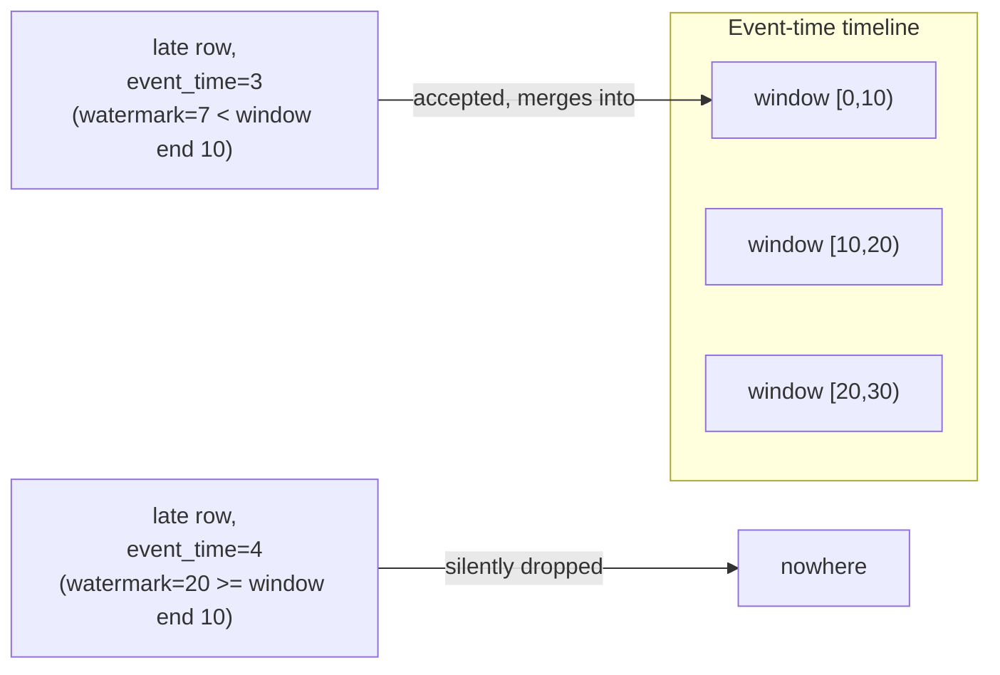

# Lesson 3 — Watermarks and Windowed Aggregations

Real event streams arrive out of order — a mobile client can buffer an event for minutes before it
reaches your pipeline. Windowed aggregations group rows by **event time** (when something actually
happened), not **processing time** (when Spark saw it) — but Spark can't wait forever for
stragglers before finalizing a window's answer. A **watermark** is the rule that says how long is
long enough to wait, and this lesson verifies precisely what happens to a row that misses it.



## Setting it up

```python
from pyspark.sql.functions import window, col, count, sum as spark_sum

windowed = (
    stream_df.withWatermark("event_time", "5 seconds")
    .groupBy(window(col("event_time"), "10 seconds"))
    .agg(count("*").alias("cnt"), spark_sum("order_id").alias("total"))
)
```

`withWatermark("event_time", "5 seconds")` tells Spark: once you've seen an event_time value of
`T`, treat the "current time" for lateness purposes as `T - 5 seconds`, and consider any window
that has fully closed *as of that watermark* finalized — never expect data for it again.

## The experiment, verified end to end

Five rows fed to the same running query, one at a time, event times chosen deliberately:

| # | event_time | Row | What it should do |
|---|---|---|---|
| 1 | `0s` | order 1 | opens window `[0,10)` |
| 2 | `12s` | order 2 | opens window `[10,20)`, advances watermark to `12-5=7s` |
| 3 | `3s` (**late**) | order 100, "late-but-ok" | watermark is `7s`, window `[0,10)` (end=10) is still open — should be **accepted** |
| 4 | `25s` | order 4 | advances watermark to `25-5=20s`, which closes both `[0,10)` and `[10,20)` |
| 5 | `4s` (**late**) | order 999, "late-and-dropped" | watermark is now `20s`, window `[0,10)` (end=10) closed long ago — should be **silently dropped** |

Verified final state of the result table, after all 5 rows:

```
+-------------------+-------------------+---+-----+
|w_start            |w_end              |cnt|total|
+-------------------+-------------------+---+-----+
|2024-01-01 00:00:00|2024-01-01 00:00:10|2  |101  |
|2024-01-01 00:00:10|2024-01-01 00:00:20|1  |2    |
|2024-01-01 00:00:20|2024-01-01 00:00:30|1  |4    |
+-------------------+-------------------+---+-----+
```

Two facts confirmed by these numbers, not assumed:

- **Row 3 (late, but still within the watermark) was genuinely merged into `[0,10)`**: `cnt` is `2`
  (not 1) and `total` is `101` = `1 + 100` — Spark correctly added the late "late-but-ok" row's
  `order_id=100` to the existing window instead of rejecting it or opening a duplicate window.
- **Row 5 (late, past the watermark) is nowhere in the output at all.** `[0,10)`'s `total` stayed
  at `101` — if the row had been silently *included* it would read `1100`; if it had raised an
  error the query would have crashed. Neither happened. **And it wasn't rejected at read time
  either** — that trigger's `query.lastProgress["numInputRows"]` was `1`, confirming Spark genuinely
  read the row as input and then discarded it during the windowing/watermark step, with zero
  error, zero warning, zero trace in the output.

## Why this matters in production

A watermark that's too tight silently discards legitimately late data with no error to alert you —
your dashboards will just quietly under-count, and the only way to catch it is instrumenting how
many rows a stage drops (or noticing a downstream reconciliation job disagrees with the stream).
A watermark that's too loose keeps windows open (and their state in memory) far longer than
necessary, which is a real memory cost at scale, not just a correctness knob.

**Best-practice callout:** size the watermark from your actual measured worst-case event lateness
(check upstream client buffering/retry behavior, network partition recovery times), not a guess —
and if you can, track `numInputRows` against window-emitted-row counts over time so a
too-tight watermark shows up as a gap rather than a silent, permanent undercount.

`append` output mode (Lesson 1) specifically *requires* a watermark on a windowed aggregation —
Spark needs a rule for "this window is truly final" before it's willing to emit it just once and
never revisit it, which is exactly what `append` mode promises the sink.

> **Benign noise you may see:** calling `query.stop()` right after a `complete`-mode memory-sink
> query finishes its last batch occasionally logs a `WriteToDataSourceV2Exec ... is aborting` /
> `RejectedExecutionException` error to stderr — a shutdown race between the stop call and that
> epoch's in-flight commit, not a real failure. Verified: it never affected the final result table
> or any assertion in this lesson's experiment, only appeared in stderr after the correct output
> was already printed.

---
**Next:** [Lesson 4 — Checkpointing and Fault Tolerance](04-checkpointing-and-fault-tolerance.md)
