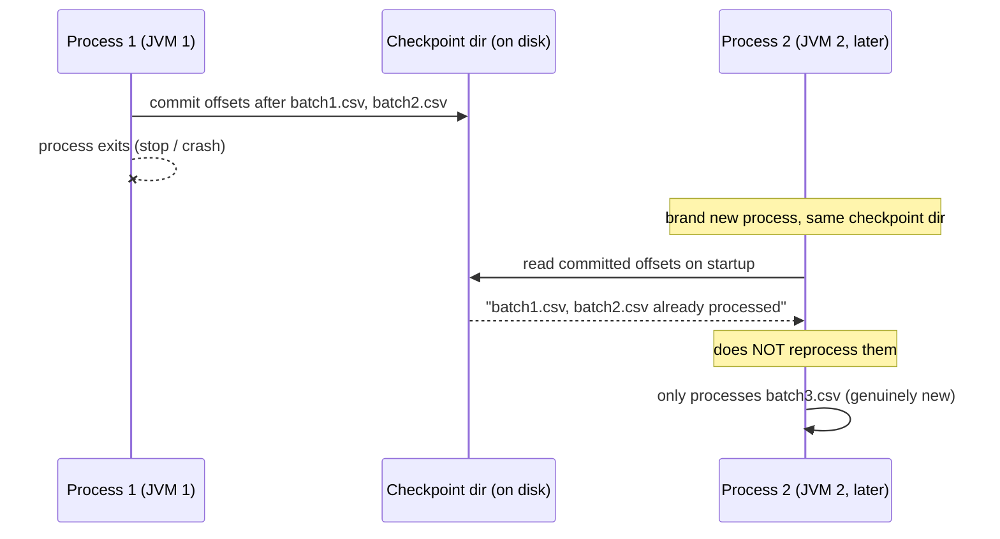

# Lesson 4 — Checkpointing and Fault Tolerance

Every streaming query needs a `checkpointLocation` — it's what lets a query survive a crash, a
deliberate restart, or a code deploy without reprocessing data it already committed, or silently
duplicating output. This lesson proves it with the strongest test available: killing the process
running the query entirely and starting a **brand new Python process and a brand new JVM**
pointed at the same checkpoint directory, not just reusing a query object in memory.



## The setup

```python
query = (
    stream_df.writeStream
    .format("parquet")
    .option("path", "/output")
    .option("checkpointLocation", "/checkpoints/orders")   # the important part
    .outputMode("append")
    .start()
)
```

The checkpoint directory tracks, durably on disk: which source offsets (which files, for a file
source) have been processed and committed, and any aggregation state a windowed query needs
(Lesson 3). Losing it means losing that bookkeeping entirely — Spark has no other memory of what
it already did.

## The experiment: two genuinely separate processes, same checkpoint

**Process 1** (`python stream_app.py stage1 ...`) starts a query, processes `batch1.csv` then
`batch2.csv`, and stops cleanly:

```
STAGE1: batches processed = 2
[stage1] output row count = 2
+--------+--------+------+
|order_id|customer|amount|
+--------+--------+------+
|       1|   alice|  10.0|
|       2|     bob|  20.0|
+--------+--------+------+
```

**Process 1 then exits completely** — the Python process ends, the JVM ends, nothing about this
query is running anywhere. Later, **Process 2** (`python stream_app.py stage2 ...`, a fresh
invocation with a fresh interpreter and a fresh JVM) starts a new query against the exact same
`input_dir`/`checkpointLocation`/output `path`, then a new file `batch3.csv` is dropped in:

```
STAGE2: batches processed on restart, BEFORE new file = 0     <- fresh query object, its own progress log starts empty
STAGE2: batches processed after adding batch3.csv = 1
STAGE2: last batch numInputRows = 1
[stage2] output row count = 3
+--------+--------+------+
|order_id|customer|amount|
+--------+--------+------+
|       1|   alice|  10.0|
|       2|     bob|  20.0|
|       3|   carol|  30.0|
+--------+--------+------+
```

Verified, precisely: the output has **exactly 3 rows, not 5** — `batch1.csv` and `batch2.csv` were
never reprocessed on restart, even though they're still sitting in the source directory exactly as
before. Process 2's own micro-batch only picked up `batch3.csv` (`numInputRows = 1`). This is the
whole value proposition of checkpointing in one number: a real crash-and-restart produced zero
duplicate rows, with no dedup logic written anywhere in the query itself.

## What this means in practice

- **Never delete or share a checkpoint directory across unrelated queries.** Sharing one between
  two different queries (even innocently, e.g. copy-pasted code that forgot to change the path)
  corrupts both — a checkpoint's offsets and state are meaningful only for the exact query that
  wrote them.
- **Changing the query's logic (not just restarting it) can be genuinely unsafe** against an
  existing checkpoint — adding/removing an aggregation, changing a windowing column, or in some
  cases changing the number of shuffle partitions can make Spark refuse to resume, or resume with
  wrong results. Treat checkpoint compatibility as part of your deployment process for streaming
  jobs, not an afterthought.
- **A missing/deleted checkpoint means Spark has no memory of anything it already did** — the very
  next run would treat every file in the source directory as brand new, producing duplicates (or
  re-computing every window from scratch). This is why "just delete the checkpoint to fix an
  issue" is a real production incident waiting to happen, not a harmless reset.

---
**Next:** [Lesson 5 — foreachBatch and the Streaming Debugging Workflow](05-foreachbatch-and-debugging.md)
