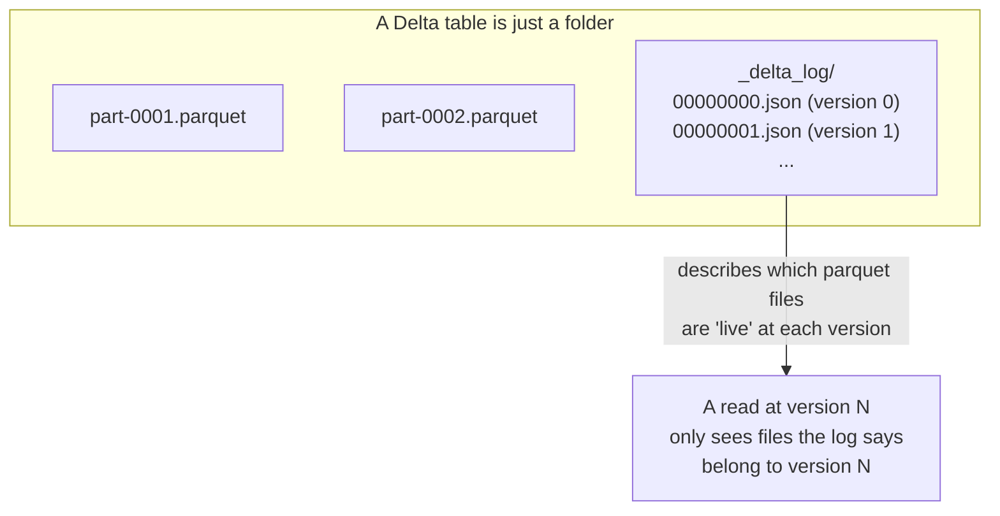

# Lesson 1 — ACID Tables and Time Travel

Every write in Modules 02-10 has been a plain file write: CSV/Parquet/JSON, no transaction log,
no history. Delta Lake adds a transaction log (`_delta_log/`) on top of Parquet files, which is
what turns a folder of files into something with ACID guarantees, versioning, and time travel —
without changing the DataFrame API you already know at all.



## Writing and reading a Delta table — same API you already know

```python
df1 = spark.createDataFrame([(1, "alice", 10.0), (2, "bob", 20.0)], ["order_id", "customer", "amount"])
df1.write.format("delta").mode("overwrite").save(table_path)   # version 0

df2 = spark.createDataFrame([(3, "carol", 30.0)], ["order_id", "customer", "amount"])
df2.write.format("delta").mode("append").save(table_path)      # version 1
```

Only the format string changed (`"delta"` instead of `"parquet"`). Reading back gives the current
state, exactly like a Parquet read:

```python
spark.read.format("delta").load(table_path).show()
```

```
+--------+--------+------+
|order_id|customer|amount|
+--------+--------+------+
|       1|   alice|  10.0|
|       2|     bob|  20.0|
|       3|   carol|  30.0|
+--------+--------+------+
```

## Time travel, verified

Every write is a new, numbered **version**. You can read any past version directly:

```python
spark.read.format("delta").option("versionAsOf", 0).load(table_path).show()
```

Verified: this returns exactly the version-0 state — `alice` and `bob` only, **not** `carol**,
even though `carol`'s row is sitting in the same folder on disk right now. The transaction log is
what makes this possible: version 0's log entry lists exactly which Parquet files belonged to that
version, and the reader only looks at those. `option("timestampAsOf", "2026-01-01 00:00:00")` works
the same way, keyed by wall-clock time instead of a version number.

## The transaction log, inspected directly

```python
from delta.tables import DeltaTable
dt = DeltaTable.forPath(spark, table_path)
dt.history().select("version", "operation", "operationParameters").show(truncate=False)
```

Verified output:

```
+-------+---------+---------------------------------------+
|version|operation|operationParameters                     |
+-------+---------+---------------------------------------+
|1      |WRITE    |{mode -> Append, partitionBy -> []}     |
|0      |WRITE    |{mode -> Overwrite, partitionBy -> []}  |
+-------+---------+---------------------------------------+
```

Every operation against the table — every write, `MERGE` (Lesson 2), schema change (Lesson 3),
`OPTIMIZE`/`VACUUM` (Lesson 4) — gets its own row here, in order, forever (until `VACUUM` cleans up
old file versions, Lesson 4). This is a real, queryable audit log, not a marketing claim.

## Why this matters: the problem batch Parquet writes don't solve

- **No atomicity across files.** A batch job writing 200 output files that dies after writing 150
  of them leaves a batch Parquet "table" in a half-written state — readers see a partial,
  inconsistent result with zero indication anything's wrong. A Delta write only becomes visible to
  readers once the entire transaction commits — verified behavior, not just a claim: a version's
  log entry is the single atomic switch that makes a whole batch of files visible at once.
- **No safe way to fix a bad write.** With plain Parquet, "undo yesterday's bad load" means finding
  a backup, or re-running the whole upstream pipeline. With Delta, it's
  `spark.read.format("delta").option("versionAsOf", N).load(...)` to see what it looked like, and
  Lesson 4 covers `RESTORE` to actually roll the table back.
- **No row-level updates/deletes at all.** Plain Parquet has no `UPDATE`/`DELETE`/`MERGE` — the only
  option is rewriting entire files or partitions yourself. Lesson 2 covers `MERGE`, which is the
  single biggest practical reason most real lakehouses use Delta (or an equivalent) at all.

## Best-practice callout

**First run needs internet access.** `configure_spark_with_delta_pip(...)` resolves the Delta JARs
from Maven Central via Ivy the first time you run it (cached under `~/.ivy2` afterward) — on a
locked-down corporate network this can fail exactly like any other first-time Maven/pip resolution
would. If it fails, check proxy/firewall settings the same way you would for a blocked `pip install`.

---
**Next:** [Lesson 2 — MERGE and Upserts](02-merge-and-upserts.md)
