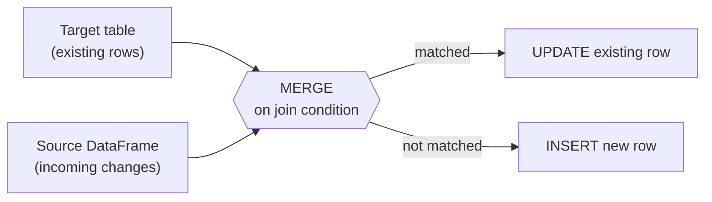

# Lesson 2 — MERGE and Upserts

`MERGE` is the single biggest practical reason most real lakehouses use Delta at all: row-level
"update if it exists, insert if it doesn't" (an **upsert**), done as one atomic operation. Plain
Parquet has no equivalent — the only options are rewriting whole files yourself or reloading the
entire table.



## A real upsert, verified

```python
from delta.tables import DeltaTable

dt = DeltaTable.forPath(spark, table_path)   # existing: alice/gold/100, bob/silver/50, carol/silver/75

updates = spark.createDataFrame(
    [(2, "bob", "silver", 90), (4, "dave", "bronze", 10)],   # bob changes, dave is brand new
    ["cust_id", "name", "tier", "points"],
)

(
    dt.alias("t")
    .merge(updates.alias("s"), "t.cust_id = s.cust_id")
    .whenMatchedUpdateAll()
    .whenNotMatchedInsertAll()
    .execute()
)
```

Verified result — one atomic operation, both an update and an insert applied correctly, everything
else untouched:

```
+-------+-----+------+------+
|cust_id| name|  tier|points|
+-------+-----+------+------+
|      1|alice|  gold|   100|   <- untouched
|      2|  bob|silver|    90|   <- UPDATED (was 50)
|      3|carol|silver|    75|   <- untouched
|      4| dave|bronze|    10|   <- INSERTED (new)
+-------+-----+------+------+
```

`whenMatchedUpdateAll()`/`whenNotMatchedInsertAll()` are the common case, but every clause accepts
a condition and an explicit column mapping too — e.g.
`.whenMatchedUpdate(condition="s.points > t.points", set={"points": "s.points"})` to only update
when the incoming value is actually higher, or `.whenMatchedDelete()` to delete matched rows
instead. `dt.history(1).select("operationMetrics")` after a `MERGE` gives you exact counts —
verified fields include `numTargetRowsUpdated`, `numTargetRowsInserted`, `numTargetRowsDeleted`,
and `numTargetRowsCopied` (rows in touched files that didn't change but got rewritten anyway) —
genuinely useful for confirming a `MERGE` did what you expected instead of trusting it silently.

## Schema evolution — and a real trap: append + mergeSchema is NOT an upsert

```python
new_col = spark.createDataFrame([(1, "alice", "gold", 100, "US")], ["cust_id", "name", "tier", "points", "country"])
new_col.write.format("delta").mode("append").save(table_path)
```

Verified: this fails outright — `AnalysisException: [_LEGACY_ERROR_TEMP_DELTA_0007] A schema
mismatch detected when writing to the Delta table`. Delta protects you from silently widening a
table's schema by accident. Add `.option("mergeSchema", "true")` and it succeeds, backfilling
`NULL` for the new column on every pre-existing row.

**The trap, verified directly:** doing this with `cust_id=1` (a key that **already exists** in the
table) doesn't update alice's row — it appends a **second, duplicate row for `cust_id=1`**:

```
+-------+-----+------+------+-------+
|cust_id| name|  tier|points|country|
+-------+-----+------+------+-------+
|      1|alice|  gold|   100|     US|   <- the newly appended row
|      1|alice|  gold|   100|   NULL|   <- the ORIGINAL row, still there, untouched
|      2|  bob|silver|    90|   NULL|
|      3|carol|silver|    75|   NULL|
|      4| dave|bronze|    10|   NULL|
+-------+-----+------+------+-------+
```

`mergeSchema` only ever solves the **schema** problem (letting a write with new/different columns
succeed). It has nothing to do with row-level identity — `.mode("append")` still means append, full
stop. If what you actually want is "update this key if it exists, insert if it's new, and also
tolerate a new column," that's still `MERGE`'s job, not a schema-evolution option. Mixing these two
concepts up is an easy, genuinely data-corrupting mistake — you get silent duplicate rows, not an
error.

## Best-practice callout

- Prefer `whenMatchedUpdateAll()`/`whenNotMatchedInsertAll()` when a full-row replace is really what
  you want; use the explicit `set={...}` form when you need to preserve some existing columns
  (e.g. a `created_at` that should never change on update).
- Always check `operationMetrics` after a production `MERGE`, at least during development — a
  `MERGE` with an overly broad or wrong join condition can silently update/insert far more (or
  fewer) rows than intended, and it will not raise an error for that.

---
**Next:** [Lesson 3 — OPTIMIZE and VACUUM](03-optimize-and-vacuum.md)
