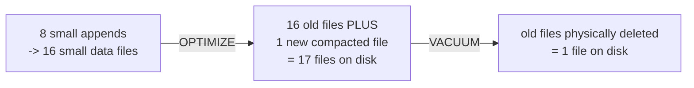

# Lesson 3 — OPTIMIZE and VACUUM

Every append (Module 06's small-file problem, now inside a Delta table too) leaves behind small
files. `OPTIMIZE` compacts them into fewer, larger ones. `VACUUM` physically deletes files a table
no longer needs. This lesson verifies a genuinely important, easy-to-get-backwards fact: **these
are two separate steps, and `OPTIMIZE` alone does not shrink anything on disk.**



## OPTIMIZE compacts — but doesn't delete the old files, verified

```python
# 8 separate single-row appends -- a realistic small-file scenario
for i in range(8):
    spark.createDataFrame([(i, f"user{i}", i * 1.5)], ["event_id", "user", "value"]) \
        .write.format("delta").mode("append").save(table_path)

print(count_data_files())   # 16 -- verified: 8 appends produced 16 files, not 8
```

```python
dt = DeltaTable.forPath(spark, table_path)
dt.optimize().executeCompaction()

print(count_data_files())   # 17 -- went UP, not down
print(dt.toDF().count())    # 8 -- data is correct either way
```

Verified, and easy to get backwards: after `OPTIMIZE`, the file count went **up** (16 → 17), not
down. `OPTIMIZE` writes new, compacted files and updates the transaction log so the *current
version* only reads the new compacted file — but it leaves the old small files sitting on disk
untouched, because time travel (Lesson 1) might still need them to reconstruct an older version.
Reading the table gives the correct 8 rows either way; only the physical file count changes.

## VACUUM actually deletes — and has a safety net, verified

```python
dt.vacuum(0)   # 0 hours retention: delete anything not needed for the CURRENT version
```

```
IllegalArgumentException: requirement failed: Are you sure you would like to vacuum files with
such a low retention period?
```

Verified: Delta refuses a retention period below its safety default (7 days) unless you explicitly
disable the check:

```python
spark.conf.set("spark.databricks.delta.retentionDurationCheck.enabled", "false")
dt.vacuum(0)
```

```
Deleted 16 files and directories in a total of 1 directories.
```

Verified: exactly the 16 old pre-`OPTIMIZE` files were deleted — `count_data_files()` afterward is
`1` (just the compacted file), and the current version's row count is still correctly `8`.

## VACUUM breaks time travel to anything it deletes — verified

```python
spark.read.format("delta").option("versionAsOf", 0).load(table_path).show()
```

```
Py4JJavaError: An error occurred while calling o216.showString.
```

Verified: reading an old version whose files were just deleted by `vacuum(0)` genuinely fails —
`VACUUM` is destructive to history, on purpose. This is exactly why the default retention is 7 days
and why the safety check exists: a 7-day window is meant to comfortably outlast any in-flight
readers or long-running queries that might still need an older version, while still eventually
reclaiming space from files nothing needs anymore.

## Best-practice callout

- **Never disable the retention safety check in production "just to clean up faster."** The default
  7-day window exists specifically so a long-running query, a paused stream about to resume
  (Module 10's checkpoint recovery), or someone's `versionAsOf` debugging session doesn't have its
  files yanked out from under it mid-read.
- **Run `OPTIMIZE` regularly on tables with frequent small writes** (streaming sinks, Module 10;
  micro-batch loads) — the small-file problem compounds identically to plain Parquet (Module 06),
  Delta doesn't make it disappear on its own.
- A common production pattern is `OPTIMIZE` on a schedule (e.g. nightly) followed by `VACUUM` at
  the default retention — compact regularly, reclaim space conservatively.

---
**Next:** [Lesson 4 — Concurrency, RESTORE, and Constraints](04-concurrency-and-restore.md)
