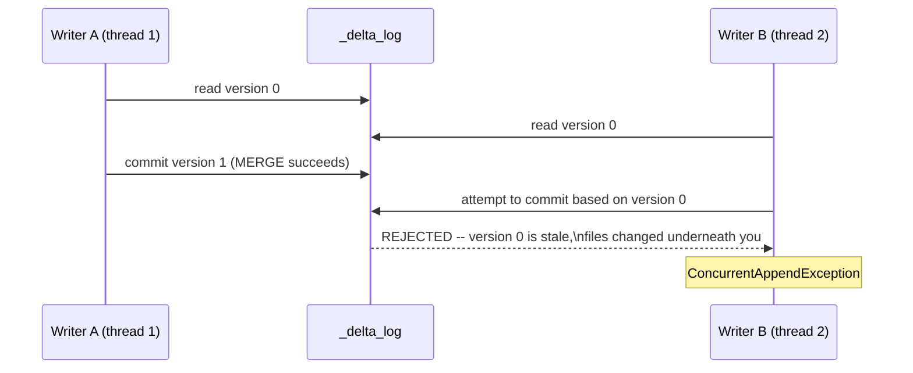

# Lesson 4 — Concurrency, RESTORE, and Constraints

Lesson 1 claimed Delta gives you ACID guarantees. This lesson proves the "I" — **Isolation** —
concretely: two writers genuinely racing to update the same row, verified live with real threads,
not simulated. It also verifies `RESTORE`, the safe, non-destructive way to undo a bad write.



## Two threads, one row, verified

```python
def writer_a():
    dt = DeltaTable.forPath(spark, table_path)
    updates = spark.createDataFrame([(1, "alice", 999)], ["acct_id", "name", "balance"])
    dt.alias("t").merge(updates.alias("s"), "t.acct_id = s.acct_id").whenMatchedUpdateAll().execute()

def writer_b():
    dt = DeltaTable.forPath(spark, table_path)
    updates = spark.createDataFrame([(1, "alice", 111)], ["acct_id", "name", "balance"])
    dt.alias("t").merge(updates.alias("s"), "t.acct_id = s.acct_id").whenMatchedUpdateAll().execute()

t1, t2 = threading.Thread(target=writer_a), threading.Thread(target=writer_b)
t1.start(); t2.start(); t1.join(); t2.join()
```

Verified, real output:

```
writer_a: success
writer_b: FAILED: ConcurrentAppendException: [DELTA_CONCURRENT_APPEND] ConcurrentAppendException:
Files were added to the root of the table by a concurrent update. Please try the operation again.
```

**This is optimistic concurrency control, verified in action, not asserted from documentation.**
Both threads read the same starting version. Writer A's `MERGE` committed first (version 1).
Writer B's `MERGE` then tried to commit *also based on version 0* — Delta detected that the files
it planned to touch no longer matched the current state and rejected it outright, rather than
silently letting the two writes race and produce a corrupted or nondeterministic result. The final
table correctly shows `alice=999` (writer A's value) and exactly one new version was created — the
failed writer never got a version at all. **The error message itself tells you the fix:** "please
try the operation again" — a real production `MERGE` job should catch this exception and retry, not
treat it as fatal.

## RESTORE — safe, non-destructive undo, verified

```python
dt.restoreToVersion(0)   # roll the table's DATA back to how version 0 looked
```

Verified, checking `dt.history()` before and after:

```
versions before restore: [1, 0]
history after restore:
+-------+---------+
|version|operation|
+-------+---------+
|      2|  RESTORE|   <- a NEW version, not a deletion of version 1
|      1|    MERGE|
|      0|    WRITE|
+-------+---------+
```

Verified, and worth internalizing precisely: `RESTORE` does **not** delete version 1 or rewrite
history — it creates a brand new version (2) whose data matches version 0. This means restoring a
table is itself an undoable action (you could `RESTORE` again to get back version 1's state), and
the full audit trail of "what happened and when" is preserved either way — genuinely different from
"rolling back" in the sense of erasing what happened.

## Best-practice callout

- **Always catch `ConcurrentAppendException` (and its siblings — `ConcurrentDeleteReadException`,
  `ConcurrentDeleteDeleteException`) around any `MERGE`/`UPDATE`/`DELETE` that might race with
  another writer, and retry.** This is the normal, expected way concurrent Delta writes resolve —
  not an edge case to special-case away.
- **Prefer `RESTORE` over manually deleting and rewriting data to undo a bad load.** It's atomic,
  it's auditable in `history()`, and — unlike `VACUUM` (Lesson 3) — it's non-destructive as long as
  the version you're restoring *from* hasn't itself been vacuumed away.
- Two writers touching **genuinely disjoint** rows/files usually don't conflict at all — Delta's
  conflict detection is file-level, not table-level. The example above deliberately targets the
  same row to make the conflict certain and reproducible for this lesson; don't assume any two
  concurrent writers to the same table will always collide.

---
**Next:** [Lesson 5 — Medallion Architecture](05-medallion-architecture.md)
