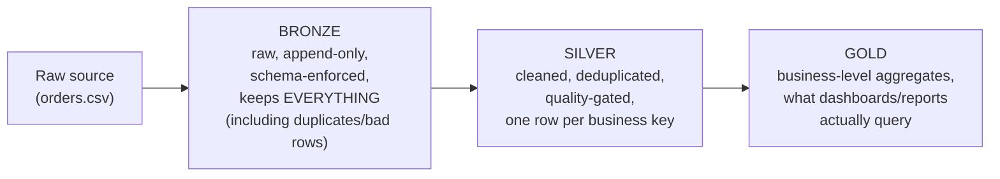

# Lesson 5 — Medallion Architecture

**Medallion architecture** is a naming convention for a very common lakehouse pattern: three
progressively more refined layers of tables, each with a distinct job. It's not a Delta *feature* —
it's an architectural pattern that Delta's ACID writes, `MERGE`, and time travel (Lessons 1-4) make
practical to actually operate. This lesson builds a real 3-layer pipeline against `orders.csv` and
verifies each layer does its job.



## Bronze: raw truth, duplicates and all — verified

```python
raw = spark.read.csv("orders.csv", header=True, inferSchema=True)
raw.write.format("delta").mode("overwrite").save(bronze_path)          # batch 1: 15 rows

# a realistic scenario: upstream re-sends order_id=1001 (retry, replay, whatever)
resend = raw.filter(col("order_id") == 1001)
resend.write.format("delta").mode("append").save(bronze_path)          # batch 2: the same row again
```

Verified: bronze goes from **15 rows to 16** after the re-send — bronze's job is to capture what
actually arrived, unconditionally, including the duplicate. **Never deduplicate or "clean" at the
bronze layer** — if upstream genuinely sent something twice, or sent a malformed row, that's a fact
about what happened, and bronze is your only permanent record of it. Debugging "why does silver
have the wrong count" always starts by checking whether bronze's raw count already explains it.

## Silver: cleaned, deduplicated, one row per key — verified

```python
w = Window.partitionBy("order_id").orderBy(col("order_date").desc())
deduped = (
    bronze_df.withColumn("rn", row_number().over(w))
    .filter(col("rn") == 1)
    .drop("rn")
    .filter(col("amount") > 0)   # a real data-quality gate
)
deduped.write.format("delta").mode("overwrite").save(silver_path)
```

Verified: silver is back down to **15 rows** — exactly bronze's 16 minus the one genuine duplicate,
confirmed directly:

```
order_id=1001 in bronze: 2 rows (raw truth, duplicate included)
order_id=1001 in silver: 1 row (deduped)
```

Silver is where Module 07's window-function dedup pattern (`row_number()` + filter) and data
quality gates (`amount > 0`) belong — this is the layer that answers "what is the one correct,
current row for this business key," not "what literally arrived."

## Gold: business-ready aggregates — verified

```python
gold = silver_df.groupBy("region").agg(spark_sum("amount").alias("total_amount"), spark_count("*").alias("order_count"))
gold.write.format("delta").mode("overwrite").save(gold_path)
```

Verified output — a real, correct business aggregate built entirely on top of the deduplicated
silver layer:

```
+------+------------+-----------+
|region|total_amount|order_count|
+------+------------+-----------+
|  East|     2500.74|          4|
| North|     1461.24|          3|
| South|       250.0|          1|
|  West|     3670.99|          7|
+------+------------+-----------+
```

`4 + 3 + 1 + 7 = 15` — matches silver's row count exactly, confirming gold's aggregate genuinely
rolled up every deduplicated silver row exactly once. If bronze's duplicate `order_id=1001` row had
leaked through to gold uncaught, West's total would be inflated by an extra `250.00` — a class of
silent, hard-to-notice bug this three-layer separation exists specifically to prevent.

## Why three layers, not just one "cleaned" table

- **Bronze lets you re-derive silver/gold from scratch** if a cleaning rule turns out to be wrong —
  you still have the raw, unmodified data. A pipeline that cleans on ingest and discards the raw
  input has no way to recover from "we deduped on the wrong column for six months."
- **Silver is the layer to unit-test** (Module 13) — one row per key, quality-gated, is a stable
  contract downstream consumers can rely on.
- **Gold stays cheap to query** because it's pre-aggregated — dashboards and BI tools hit gold, not
  bronze or silver, so a slow scan-and-aggregate only happens once (when gold is built/refreshed),
  not on every dashboard load.

## Best-practice callout

Each layer is naturally a great fit for the tools from earlier lessons: `MERGE` (Lesson 2) is often
how silver is *incrementally* upserted from new bronze batches in a real pipeline (rather than the
full `overwrite` used here for a clear one-shot example); `OPTIMIZE`/`VACUUM` (Lesson 3) apply at
every layer but matter most on bronze, which typically has the most/smallest files from frequent
raw ingestion.

---
Check the boxes in [`PROGRESS.md`](../PROGRESS.md), then: [`exercises/`](exercises/) before
[`solutions/`](solutions/), then [`quiz.md`](quiz.md).
