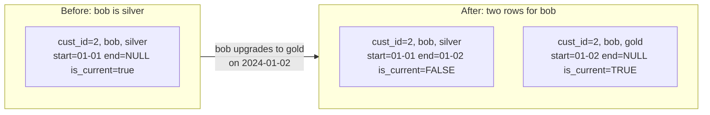

# Lesson 2 — Slow Changing Dimensions (SCD Type 2)

A dimension table (customers, products, employees) changes over time — a customer upgrades tiers,
an employee changes department. **SCD Type 1** just overwrites the old value (Module 11's `MERGE`,
`whenMatchedUpdateAll()` — you lose the history). **SCD Type 2** keeps every version, each tagged
with when it was current, which is what lets you correctly answer "what tier was this customer on
the day of that order?" This lesson builds and verifies a real Type 2 pipeline.



## The pipeline: three steps, verified

**Step 1 — detect which keys genuinely changed** (comparing incoming data to the *current* row
only, not the whole history):

```python
current = dt.toDF().filter("is_current = true")
changed = incoming.alias("i").join(current.alias("c"), "cust_id").filter("i.tier != c.tier").select("i.cust_id")
```

**Step 2 — expire the current row for changed keys** (a targeted `MERGE`, only touching rows that
are both matched AND currently active):

```python
(
    dt.alias("t")
    .merge(changed.alias("s"), "t.cust_id = s.cust_id AND t.is_current = true")
    .whenMatchedUpdate(set={"is_current": "false", "effective_end": "'2024-01-02'"})
    .execute()
)
```

**Step 3 — insert new current versions**, for both changed keys and brand-new keys:

```python
to_insert = incoming.filter(incoming.cust_id.isin(changed_ids) | ~incoming.cust_id.isin(existing_ids)) \
    .selectExpr("cust_id", "name", "tier",
                "'2024-01-02' as effective_start", "CAST(NULL AS STRING) as effective_end", "true as is_current")
to_insert.write.format("delta").mode("append").save(table_path)
```

## Verified result

Starting state: alice (gold), bob (silver), carol (silver), all `is_current=true`. Incoming: bob
upgrades to gold, dave is a brand new customer.

```
+-------+-----+------+---------------+-------------+----------+
|cust_id|name |tier  |effective_start|effective_end|is_current|
+-------+-----+------+---------------+-------------+----------+
|1      |alice|gold  |2024-01-01     |NULL         |true      |   <- untouched
|2      |bob  |silver|2024-01-01     |2024-01-02   |false     |   <- EXPIRED (old version)
|2      |bob  |gold  |2024-01-02     |NULL         |true      |   <- NEW current version
|3      |carol|silver|2024-01-01     |NULL         |true      |   <- untouched
|4      |dave |bronze|2024-01-02     |NULL         |true      |   <- brand new customer
+-------+-----+------+---------------+-------------+----------+
```

Verified precisely: bob now has **two rows** — the full history is preserved, not overwritten —
while alice and carol (unchanged) still have exactly **one** row each, and dave (brand new) got
exactly **one** current row inserted directly, correctly skipping the "expire" step entirely since
there was no prior version of him to expire.

## Querying history correctly

The entire point of SCD2 is being able to answer point-in-time questions:

```python
# "what tier was cust_id=2 on when this order happened, on 2024-01-01?"
history_df.filter(
    (col("cust_id") == 2) & (col("effective_start") <= "2024-01-01") &
    (col("effective_end").isNull() | (col("effective_end") > "2024-01-01"))
)
```

This is exactly why `effective_end` (not just `is_current`) matters — `is_current` alone can only
answer "what's true right now," never "what was true on some date in the past."

## A real trap, verified: even `.cache()` is not enough — collect to Python before the MERGE

A tempting shortcut is to keep `changed` as a DataFrame and reuse it directly for both the `MERGE`
and the later insert step. Tried exactly that, verified it breaks:

```python
changed = incoming.alias("i").join(current.alias("c"), "cust_id").filter("i.tier != c.tier") \
    .select("i.cust_id", "i.name", "i.tier")   # a DataFrame, not yet Python data

dt.alias("t").merge(changed.alias("s"), "...").whenMatchedUpdate(...).execute()   # mutates the table

to_insert = changed.selectExpr(...)   # re-evaluates `changed` from scratch -- AFTER the mutation!
to_insert.write.format("delta").mode("append").save(table_path)
```

Verified result: **the new gold row for bob never got inserted at all** — the table ended up with
only bob's expired silver row, no replacement. Why: `changed` is a lazy DataFrame built from
`current = dt.toDF().filter("is_current = true")`. By the time `to_insert` forces `changed` to
actually evaluate, the `MERGE` has already run and expired bob's row — so re-reading `current` at
that point no longer finds an `is_current=true` row for bob at all, and the join in `changed`
produces zero matches.

**The first fix that looks obvious — `.cache()` the DataFrame before the `MERGE` — was tried and
verified to still fail, identically.** Delta invalidates a cached DataFrame once the table it reads
from gets mutated, so re-referencing `changed` after the `MERGE` silently recomputes it against the
post-merge state regardless of the `.cache()` call. **The only fix verified to actually work** is
collecting `changed` into genuine Python data *before* the `MERGE` runs, fully decoupling the later
insert step from the table's state entirely:

```python
changed_rows = [tuple(r) for r in changed.collect()]   # plain Python data, NOW

dt.alias("t").merge(changed.alias("s"), "...").whenMatchedUpdate(...).execute()   # safe to mutate now

to_insert = spark.createDataFrame(changed_rows, ["cust_id", "name", "tier"]) \
    .selectExpr("cust_id", "name", "tier", "'2024-01-02' as effective_start", ...)
```

This is a sharper version of Module 09's caching lesson: it's not just "cache before reusing a
DataFrame across actions" — when the underlying table itself gets mutated in between, caching
doesn't protect you at all, and only fully materializing to Python-native data does. Easy to miss
because the mutation (the `MERGE`) happens *in between* two uses of the same DataFrame, not right
next to each other in the code.

## Best-practice callout

- **Only compare against the *current* row when detecting changes** (Step 1) — comparing against
  every historical row would incorrectly flag "no change" as a change if a value happens to match
  an older, already-expired version.
- **This whole pattern is naturally idempotent** (Lesson 1) if step 1's change-detection compares
  against the current row: re-running the same day's SCD2 job twice detects zero changes the second
  time (the "current" row already reflects the target state), so no duplicate history gets created.
- A real pipeline typically runs this as one Delta transaction pair per batch (expire, then
  insert) — some teams do it as a single `MERGE` with `whenMatchedUpdate` (expire) plus a UNION'd
  insert DataFrame, to keep it closer to one atomic step; the three-step version here is written out
  explicitly to make each part easy to verify separately.

---
**Next:** [Lesson 3 — Data Quality Gates](03-data-quality-gates.md)
