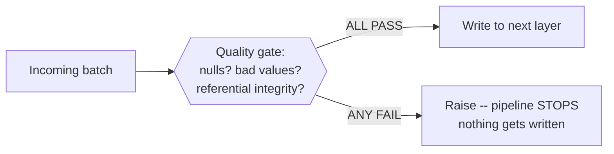

# Lesson 3 — Data Quality Gates

A **quality gate** is a check that runs between two layers of a pipeline (Module 11's bronze →
silver, silver → gold) and refuses to let bad data cross the boundary. The critical design choice,
verified here directly: **the gate must raise before the write happens**, not log a warning after.



## A gate with three independent checks, verified

```python
class DataQualityError(Exception):
    pass

def run_quality_gate(df, known_emp_ids):
    failures = []

    null_customer = df.filter(col("customer").isNull()).count()
    if null_customer > 0:
        failures.append(f"{null_customer} row(s) with NULL customer")

    non_positive_amount = df.filter(col("amount") <= 0).count()
    if non_positive_amount > 0:
        failures.append(f"{non_positive_amount} row(s) with amount <= 0")

    bad_emp_ids = [r["emp_id"] for r in df.filter(~col("emp_id").isin(known_emp_ids)).select("emp_id").distinct().collect()]
    if bad_emp_ids:
        failures.append(f"emp_id(s) not in the known employee set: {bad_emp_ids}")

    if failures:
        raise DataQualityError("Data quality gate FAILED:\n  - " + "\n  - ".join(failures))
```

This covers three distinct classes of check that between them catch most real data quality bugs:
**completeness** (required fields aren't null), **validity** (values are within sane bounds), and
**referential integrity** (foreign keys actually resolve — Module 05's join concepts, applied as a
check instead of a join result).

## Verified: a good batch passes, a bad one fails loudly and stops the write

```python
run_quality_gate(good_batch, known_emp_ids)      # passes silently
good_batch.write.mode("overwrite").parquet(gold_path)
```

```python
try:
    run_quality_gate(bad_batch, known_emp_ids)
    bad_batch.write.mode("append").parquet(gold_path)   # never reached
except DataQualityError as e:
    print(str(e))
```

Verified, all three deliberate problems caught in one pass, not just the first one found:

```
Data quality gate FAILED:
  - 1 row(s) with NULL customer
  - 1 row(s) with amount <= 0
  - emp_id(s) not in the known employee set: [999]
```

And crucially, verified directly rather than assumed: `gold`'s row count stayed at exactly **2**
after the bad batch was rejected — the `write` line genuinely never executed, because the
exception was raised *before* it, not logged as a side note after a write already happened.

## Why "raise before write," not "warn after write"

A gate that only logs a warning and lets the write proceed anyway isn't a gate — it's a comment.
The entire value of a quality gate is that bad data provably never reaches the next layer, which
this lesson verified with an actual row count, not a log message you'd have to trust. Downstream
consumers (Module 11's gold layer, a dashboard, another team's pipeline) should be able to rely on
"if it's in this table, it passed the gate" as a hard guarantee.

## Best-practice callout

- **Collect every failure before raising**, as this gate does, rather than raising on the first
  problem found — a data engineer fixing a broken upstream feed wants the complete list of what's
  wrong in one pass, not a fix-one-rerun-find-the-next loop.
- **Keep gate checks cheap relative to the pipeline they're guarding.** All three checks here are
  simple filters/counts — avoid quality checks so expensive they meaningfully slow down every run;
  save expensive checks (full referential integrity against a huge dimension table) for a sampled
  or periodic check rather than every single batch, if performance becomes a real constraint.
- Real-world quality-gate libraries (Great Expectations, Deequ, dbt tests) formalize this exact
  pattern with reusable check definitions and metrics tracking over time — this lesson's
  hand-rolled version is the same underlying idea made explicit, worth understanding before reaching
  for a framework.

---
**Next:** [Lesson 4 — Error Handling and Dead Letters at Scale](04-error-handling-and-dead-letters.md)
