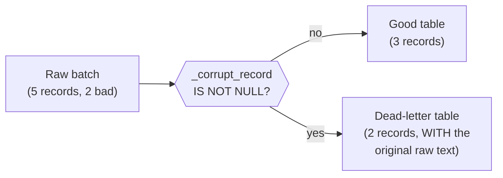

# Lesson 4 — Error Handling and Dead Letters at Scale

A batch with one malformed record shouldn't fail the other 999,999 good ones. The **dead-letter
pattern** routes bad records to a separate location instead of crashing the job or silently
dropping them — verified here with two genuinely different kinds of "bad," which turn out to
behave differently in a way worth knowing precisely.



## Two different kinds of "bad," verified to behave differently

```python
lines = [
    '{"order_id": 1, "customer": "alice", "amount": 10.0}',
    '{"order_id": 2, "customer": "bob", "amount": 20.0}',
    '{"order_id": 3, "customer": "carol" "amount": 30.0}',          # missing comma -- broken JSON
    '{"order_id": 4, "customer": "dave", "amount": "not_a_number"}', # valid JSON, WRONG TYPE
    '{"order_id": 5, "customer": "erin", "amount": 50.0}',
]
```

```python
raw = (
    spark.read.schema(schema_with_corrupt_record_column)
    .option("columnNameOfCorruptRecord", "_corrupt_record")
    .json(raw_path)
)
```

Verified output — read carefully, the two bad rows do **not** fail the same way:

```
+--------+--------+------+-------------------------------------------------------------+
|order_id|customer|amount|_corrupt_record                                              |
+--------+--------+------+-------------------------------------------------------------+
|1       |alice   |10.0  |NULL                                                         |
|2       |bob     |20.0  |NULL                                                         |
|NULL    |NULL    |NULL  |{"order_id": 3, "customer": "carol" "amount": 30.0}          |
|4       |dave    |NULL  |{"order_id": 4, "customer": "dave", "amount": "not_a_number"}|
|5       |erin    |50.0  |NULL                                                         |
+--------+--------+------+-------------------------------------------------------------+
```

Two genuinely different failure shapes, verified:

- **Row 3 — broken JSON syntax** (a missing comma): the **entire row** becomes `NULL` in every
  column, and `_corrupt_record` captures the original raw line. Nothing about this row is usable.
- **Row 4 — valid JSON, wrong type** (`amount` is the string `"not_a_number"`, but the schema says
  `DoubleType`): `order_id` and `customer` parsed **correctly** (`4`, `"dave"`) — only `amount`
  itself became `NULL`. But `_corrupt_record` is **still populated** for this row too, even though
  most of it parsed fine.

**The practical implication, verified by this exact behavior:** checking `_corrupt_record IS NOT
NULL` alone reliably catches both failure classes — it's the one condition that's populated
whenever *anything* went wrong on that line, even a single mismatched field. You don't need
separate detection logic for "totally broken" versus "partially broken."

## Splitting good from bad, verified counts

```python
good = raw.filter(col("_corrupt_record").isNull() & col("amount").isNotNull()).drop("_corrupt_record")
dead_letter = raw.filter(col("_corrupt_record").isNotNull() | col("amount").isNull())

good.write.mode("overwrite").parquet(good_path)
dead_letter.write.mode("overwrite").parquet(dead_letter_path)
```

Verified: **3 good rows** (order_id 1, 2, 5), **2 dead-letter rows** (order_id 3's fully-null row,
order_id 4's partially-parsed row) — the raw original text is preserved in the dead-letter table
via `_corrupt_record`, so whoever investigates later has the exact original input to work from, not
just "row 4 failed."

> **Reminder from Module 02:** `.count()` on a DataFrame descended from a corrupt-record read can
> be unreliable unless you force real materialization first (`.cache()` before counting) — this
> script does exactly that before printing any counts, for the same reason verified back then.

## Best-practice callout

- **Never let a single malformed record fail an entire batch job.** The dead-letter pattern turns
  "the whole nightly load crashed because of one bad row" into "999,998 rows loaded correctly, 2
  are sitting in dead-letter for someone to look at."
- **Always preserve the raw original record in the dead-letter table**, not just "which fields were
  null" — the actual bad input is what someone debugging the upstream source actually needs.
- **Alert on dead-letter volume, not just its existence.** A small, steady trickle of dead-letter
  rows is often normal (a few malformed events from a flaky upstream client); a sudden spike is a
  real incident (upstream schema changed, a client shipped a bug) worth paging someone about.

---
**Next:** [Lesson 5 — Putting It Together](05-putting-it-together.md)
