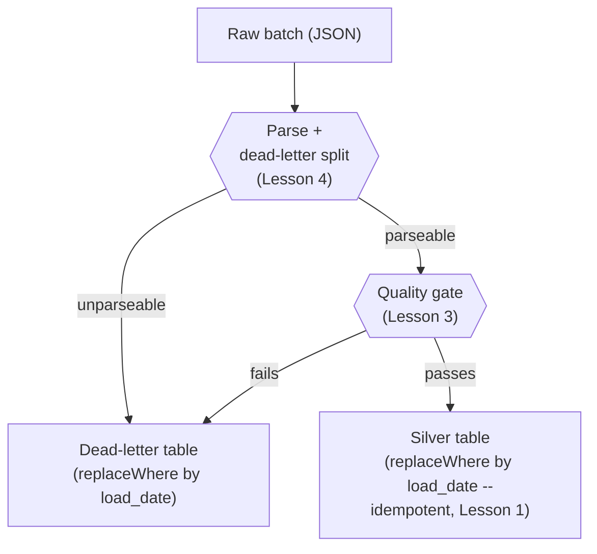

# Lesson 5 — Putting It Together

Each pattern in this module was verified in isolation. This lesson verifies they **compose**
without fighting each other — a real question, since it's easy to imagine a quality gate and a
dead-letter split stepping on each other, or an idempotent overwrite accidentally duplicating
dead-letter entries on a retry. They don't, verified directly.



## One pipeline function, all four patterns, verified

```python
def run_pipeline(load_date):
    # bronze: parse + dead-letter split
    raw = spark.read.schema(schema).option("columnNameOfCorruptRecord", "_corrupt_record").json(raw_path)
    raw = raw.withColumn("load_date", lit(load_date)).cache()   # force materialization (Module 02)

    parseable = raw.filter(col("_corrupt_record").isNull()).drop("_corrupt_record")
    unparseable = raw.filter(col("_corrupt_record").isNotNull())
    unparseable.write.format("delta").mode("overwrite") \
        .option("replaceWhere", f"load_date = '{load_date}'").partitionBy("load_date").save(dead_letter_path)

    # quality gate: bad-but-parseable rows ALSO go to dead-letter, instead of crashing the batch
    bad_amount = parseable.filter(col("amount") <= 0)
    if bad_amount.count() > 0:
        bad_amount.write.format("delta").mode("append") \
            .option("replaceWhere", f"load_date = '{load_date}'").save(dead_letter_path)
        parseable = parseable.subtract(bad_amount)

    # silver: idempotent write
    parseable.write.format("delta").mode("overwrite") \
        .option("replaceWhere", f"load_date = '{load_date}'").partitionBy("load_date").save(silver_path)
```

Fed a 4-row batch (2 clean, 1 with broken JSON syntax, 1 with a negative amount), run **twice**
with the identical input (simulating a retry):

```
run 1: silver=2, dead_letter=2
run 2 (retry, same load_date): silver=2, dead_letter=2
```

Verified: both the silver table *and* the dead-letter table stayed exactly the same size across
the retry — the same `replaceWhere` idempotency from Lesson 1 applies uniformly to both outputs of
the pipeline, not just the "happy path" output, because both writes are scoped to the same
`load_date` partition key.

## The design decisions this pipeline shape encodes

- **Dead-letter first, quality gate second.** A row has to be parseable before its *values* can
  even be checked — trying to quality-check a row that's already all-`NULL` from a JSON syntax
  error would just add noise, not information.
- **Quality-gate failures join the dead-letter table rather than crashing the pipeline.** Lesson 3
  showed raising an exception is the right move when *you* control what happens next (a scheduled
  job that should stop and alert); routing to dead-letter is the right move when the pipeline should
  keep going and still make progress on everything that's actually fine. Which one a real pipeline
  should do is a judgment call based on how bad "a few rows missing from today's silver" is versus
  "the whole job didn't run" — there's no universally correct answer, only a decision to make
  deliberately instead of by accident.
- **Both outputs share the same `load_date` idempotency key.** This is what made the whole
  pipeline safely retryable as one unit, verified — if the dead-letter write had used plain
  `append` instead of the same `replaceWhere` scoping, a retry would have silently duplicated
  dead-letter entries even while silver stayed correct.

## Best-practice callout

When designing a real pipeline, write out the shape above (or your own variant) as an explicit
diagram *before* writing code, and ask of every single write: "if this step runs twice with the
same input, what happens?" Lesson 1 already showed the naive answer is often "silently wrong" —
this lesson's point is that the fix has to be applied consistently to *every* output the pipeline
produces, not just the main one.

---
Check the boxes in [`PROGRESS.md`](../PROGRESS.md), then: [`exercises/`](exercises/) before
[`solutions/`](solutions/), then [`quiz.md`](quiz.md).
