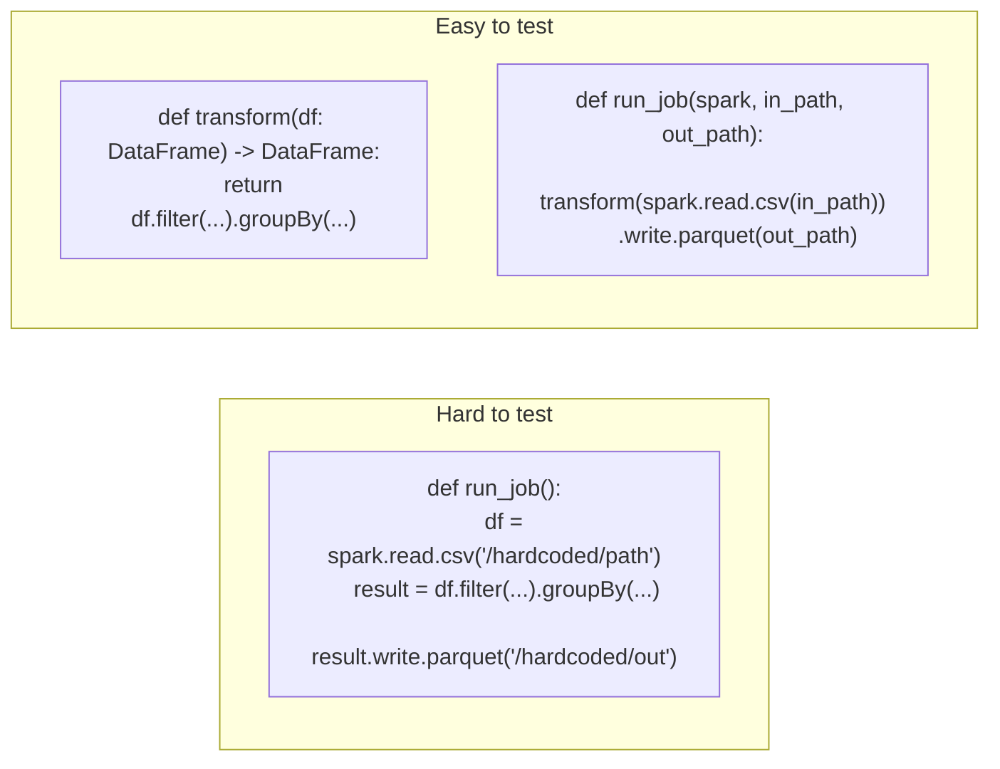

# Lesson 1 — Testable Pipeline Design

You can't unit test what you can't call in isolation. A script that reads a hardcoded file path,
transforms it, and writes to another hardcoded path has no seam a test can hook into without
touching the real filesystem (or a real Delta table, or a real upstream system). This lesson is
about the one structural change that fixes that: **separate I/O from transformation logic.**



## The pattern: pure transformation functions

```python
# transform.py -- no SparkSession creation, no I/O, no hardcoded paths
from pyspark.sql import DataFrame
from pyspark.sql.functions import col

def filter_valid_orders(df: DataFrame) -> DataFrame:
    return df.filter(col("amount") > 0).filter(col("customer").isNotNull())
```

```python
# job.py -- wires transform.py's pure functions to real I/O, only run in production
from transform import filter_valid_orders

def run_job(spark, input_path: str, output_path: str) -> None:
    raw = spark.read.csv(input_path, header=True, inferSchema=True)
    filter_valid_orders(raw).write.parquet(output_path)
```

`filter_valid_orders` takes a DataFrame and returns a DataFrame — nothing about it cares whether
that DataFrame came from a CSV file, a Delta table, or a small hand-built test fixture. This is the
entire trick: **every transformation your pipeline does should be a function like this**, and only
the thin `run_job` wrapper touches real paths and a real `SparkSession`.

## A first real test

```python
# test_transform.py
from transform import filter_valid_orders

def test_filter_valid_orders_removes_bad_rows(spark):
    df = spark.createDataFrame(
        [(1, "alice", 10.0), (2, None, 20.0), (3, "carol", -5.0)],
        ["order_id", "customer", "amount"],
    )
    result = filter_valid_orders(df)
    assert result.count() == 1
    assert result.collect()[0]["order_id"] == 1
```

No file paths, no cluster, no Delta table — just a small, hand-built DataFrame and a plain
function call. This runs in milliseconds once a `SparkSession` exists (Lesson 2 covers making that
`spark` fixture cheap to reuse across an entire test suite).

## Why this matters beyond "easier to test"

- **Tests double as living documentation.** `test_filter_valid_orders_removes_bad_rows` states
  exactly what "valid" means for this pipeline, in a way a comment can't guarantee stays accurate —
  a comment can go stale silently; a test that stops passing tells you immediately.
- **Refactoring becomes safe.** Module 12's quality gates and SCD2 logic are exactly the kind of
  code that benefits most from this — logic dense enough that a small mistake during a later
  change is easy to introduce and hard to spot by eye, but a test catches it in seconds.
- **CI can run your transformation logic without provisioning real infrastructure** — no Delta
  table, no S3 bucket, no real upstream API, just a `SparkSession` in local mode (Module 14 covers
  how this fits into a CI pipeline).

## Best-practice callout

**Resist the urge to test `run_job` itself with real files "to be thorough."** An integration test
that reads/writes real files has its place (verifying I/O wiring, format options, schema
enforcement) but it's slow and brittle compared to unit-testing `filter_valid_orders` directly —
write a handful of integration tests for the wiring, and put the bulk of your test coverage on the
pure transformation functions where the actual business logic lives.

---
**Next:** [Lesson 2 — SparkSession Fixtures and Test Speed](02-sparksession-fixtures.md)
