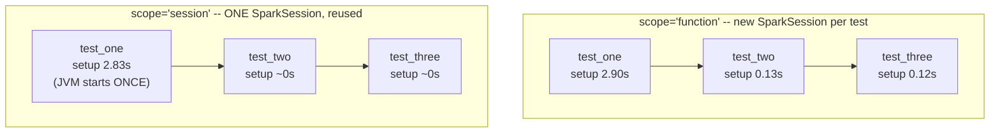

# Lesson 2 — SparkSession Fixtures and Test Speed

Starting a `SparkSession` is genuinely expensive — it launches a JVM and a Py4J gateway, not just a
Python object. A test suite that creates a fresh one per test pays that cost over and over. This
lesson verifies the fix (a `session`-scoped pytest fixture) with real, measured timing, not an
assumed speedup.



## The fixture, session-scoped

```python
# conftest.py
import pytest
from pyspark.sql import SparkSession

@pytest.fixture(scope="session")
def spark():
    spark = SparkSession.builder.appName("test-suite").master("local[*]").getOrCreate()
    spark.sparkContext.setLogLevel("ERROR")
    yield spark
    spark.stop()
```

Placed in `conftest.py`, this `spark` fixture is available to every test in the directory tree
without an import — pytest auto-discovers `conftest.py` fixtures.

## Verified: function-scoped vs session-scoped, real numbers

The same 3 trivial tests, run once with `scope="function"` and once with `scope="session"`:

**Function-scoped** (`8.75s` total): every test gets its own `setup`/`teardown` pair.
```
2.90s setup    test_one     <- JVM + Py4J gateway startup
0.53s teardown test_one
0.13s setup    test_two     <- SparkContext restart, JVM already warm -- much cheaper
0.14s teardown test_two
0.12s setup    test_three
0.20s teardown test_three
```

**Session-scoped** (`7.84s` total): setup happens once, teardown happens once.
```
2.83s setup    test_one     <- the ONLY setup for the whole session
                              (test_two, test_three: no setup at all, < 0.005s)
0.29s teardown test_three   <- the ONLY teardown, runs after the LAST test
```

Verified, and worth noting honestly: with only 3 trivial tests, the difference (`8.75s` vs `7.84s`,
about `0.91s`) looks modest. **The pattern is what matters, not this specific number** — every
additional test in the function-scoped suite pays another `~0.1-0.5s` setup/teardown pair, while
the session-scoped suite's per-test overhead stays near zero regardless of how many tests you add.
A real suite with 200 tests would see this gap turn into minutes, not under a second.

## When you'd actually want a narrower scope

`session` scope is the right default for a shared, read-only `SparkSession` object itself — but
**data created inside a test should usually NOT be session-scoped**, or one test's leftover state
can leak into another. A common, safer pattern:

```python
@pytest.fixture(scope="session")
def spark():
    ...  # one SparkSession, shared

@pytest.fixture(scope="function")
def sample_orders(spark):
    # a fresh DataFrame per test, built from the SHARED session -- cheap, no JVM restart involved
    return spark.createDataFrame([(1, "alice", 10.0)], ["order_id", "customer", "amount"])
```

Building a `DataFrame` is cheap (no JVM startup) — it's the `SparkSession`/`SparkContext` itself
that's expensive to create, so that's the piece worth sharing at `session` scope while individual
test data stays freshly built per test.

## Best-practice callout

Set `spark.sparkContext.setLogLevel("ERROR")` inside the fixture, same as every script in this
course — a test suite drowning in Spark's default `INFO`/`WARN` log noise makes real test failures
much harder to spot in CI output.

---
**Next:** [Lesson 3 — DataFrame Equality with chispa, Verified](03-dataframe-equality-with-chispa.md)
