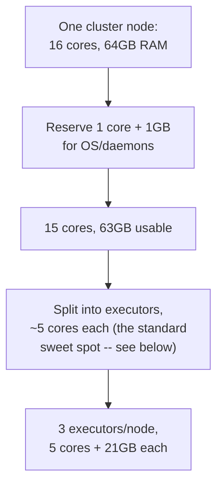

# Lesson 2 — Cluster Sizing

> **Honesty note:** this lesson is standard, widely-used sizing methodology with correct worked
> arithmetic — not something run against a live multi-node cluster in this course's environment
> (there isn't one). Treat the *reasoning* as the thing to learn; treat the specific numbers as an
> example, not a formula to blindly copy for a real cluster you're sizing.

Cluster sizing answers one question: given a cluster's hardware, how many executors should you
run, how many cores per executor, and how much memory per executor? Getting this wrong doesn't
usually crash a job outright — it just wastes hardware or throttles throughput, quietly, in a way
that's easy to never notice without deliberately reasoning through it.

## The core trade-off: cores per executor

More cores per executor means more parallel tasks per JVM, sharing one heap — sounds efficient,
but two real costs grow with it:
- **Garbage collection pauses get worse** the larger a single JVM's heap is, since a large heap
  means more live objects for a GC pause to walk through.
- **HDFS/network client throughput per executor degrades** past roughly 5 concurrent threads
  hitting the same client connections — a well-known empirical finding from Spark's own tuning
  guidance, not a Spark-enforced limit.

**The standard rule of thumb: ~5 cores per executor** balances parallelism against both costs.
Fewer cores per executor (e.g. 1-2) wastes overhead on redundant per-JVM bookkeeping across many
tiny executors; more (e.g. 10+) risks GC pauses and client throughput problems.

## A worked example

A cluster of **10 nodes**, each with **16 cores** and **64GB RAM**:

1. **Reserve resources for the OS and cluster daemons** (NameNode/ResourceManager processes if
   running YARN, etc.) — a common convention is 1 core and 1GB per node:
   `15 cores, 63GB usable per node`.
2. **Divide usable cores by ~5** (the sweet spot above): `15 / 5 = 3 executors per node`.
3. **Divide usable memory by the executor count per node**: `63GB / 3 = 21GB per executor`.
4. **Reserve off-heap overhead** — Spark reserves `max(384MB, 0.1 × executorMemory)` per executor
   for JVM overhead (thread stacks, native memory, non-JVM process memory) on top of the requested
   heap: `0.1 × 21GB ≈ 2.1GB` overhead, leaving `~18.9GB` actual heap (`spark.executor.memory`) per
   executor, with `spark.executor.memoryOverhead` covering the rest.
5. **Total cluster capacity**: `10 nodes × 3 executors = 30 executors`, `5 cores` and `~19GB` heap
   each. In `cluster` deploy mode (Lesson 1), one executor's worth of resources typically goes to
   the driver itself, leaving `29` executors for the actual application.

## Why "just use bigger executors" isn't automatically better

A single executor with all 15 usable cores and 63GB looks appealingly simple — one big JVM instead
of three — but loses the GC and I/O throughput benefits above, **and** loses fault isolation:
losing that one executor (an OOM, a node issue) drops the entire node's worth of work at once,
where three smaller executors losing one only drops a third.

## What this course's `local[*]` setup does instead

Every script in this course ran with `.master("local[*]")` — no separate executor JVMs at all, just
threads inside one process using all available cores (`spark.sparkContext.defaultParallelism`,
verified in Module 09 to equal the machine's core count). This is why `spark.executor.memory`
verified as merely *readable*, not actually consequential, in Lesson 1's local run — the sizing
reasoning in this lesson only becomes real the moment a job runs on an actual multi-executor
cluster manager (YARN, Kubernetes, standalone, or a managed platform — Lesson 3).

## Best-practice callout

Cluster sizing is a **starting point to measure from, not a one-time calculation to trust
forever.** The Spark UI's Executors tab (Module 09) shows real GC time and task duration per
executor — if GC time is consistently a large fraction of task time, that's a concrete, measured
signal to reduce cores-per-executor (smaller heaps) even if the textbook formula above suggested a
different number.

---
**Next:** [Lesson 3 — Databricks Jobs, EMR, and Standalone Clusters](03-databricks-emr-and-standalone.md)
