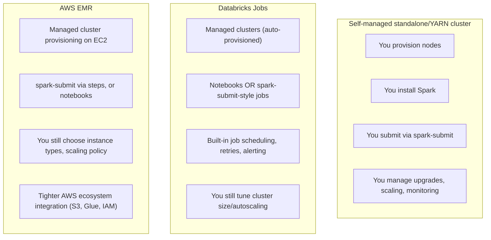

# Lesson 3 — Databricks Jobs, EMR, and Standalone Clusters

> **Honesty note:** conceptual comparison, not run against real Databricks/EMR accounts in this
> course's environment — same honest line Module 00 drew for Docker/Databricks Community Edition.
> The goal here is recognizing what each platform manages for you versus what you still own, so
> you're not starting from zero the first time you touch one professionally.

Every platform below runs the exact same Spark you've been learning — the DataFrame API, `.explain()`,
`spark-submit`'s mechanics (Lesson 1), cluster sizing reasoning (Lesson 2) — the difference is
entirely in *who manages the infrastructure underneath it* and *how a job actually gets scheduled
and run*.

## What each platform actually gives you

| | **Standalone / YARN cluster** | **Databricks Jobs** | **AWS EMR** |
|---|---|---|---|
| Who provisions machines | You | Databricks (on your cloud account) | AWS, on your account |
| Who installs/upgrades Spark | You | Databricks | AWS (via EMR release versions) |
| Job scheduling/retries | You build it (Lesson 4's Airflow) | Built into Databricks Jobs UI | You build it, or use AWS Step Functions/MWAA |
| Autoscaling | You configure and manage | Built-in cluster autoscaling | Built-in EMR managed scaling |
| Notebook-first workflow | No (script-first) | Yes, first-class | Possible (EMR Notebooks/Studio) but less central |
| Typical fit | Full control, on-prem, or specific compliance needs | Fast-moving teams wanting less infra ownership | Teams already deep in the AWS ecosystem |

## What you still own, even on a managed platform

Managed doesn't mean hands-off — every module in this course still applies directly:
- **Cluster sizing (Lesson 2)** — Databricks and EMR both still ask you to choose instance
  types/counts (or an autoscaling range); the reasoning about cores-per-executor and memory
  headroom doesn't go away, it just gets a friendlier UI in front of it.
- **Idempotency and checkpointing (Modules 10, 12)** — a managed scheduler retrying a failed job
  for you is *more* valuable, not less, if the job itself isn't safely retryable; a managed
  retry of a non-idempotent job just automates the double-counting bug.
- **Testing (Module 13)** — none of these platforms test your transformation logic for you; that's
  still on your test suite, run in CI before code ever reaches a scheduled job.
- **Delta Lake (Module 11)** — genuinely native and deeply integrated on Databricks (Databricks
  created Delta Lake); fully usable as open-source Delta on EMR/standalone too, just without some
  Databricks-specific managed features (like Unity Catalog integration).

## Choosing between them

There's no universally correct choice — it depends on constraints most job postings and system
design discussions actually care about:
- **Already deep in AWS, want tight integration with S3/Glue/IAM?** EMR is a natural fit.
- **Want the fastest path from notebook prototyping to production job, minimal infra ownership?**
  Databricks Jobs is built exactly for that workflow.
- **Specific compliance/on-prem/full-control requirements, or an existing Kubernetes/YARN
  investment?** A self-managed standalone or YARN cluster remains the right answer for real teams,
  not just a legacy option.

## Best-practice callout

When a job posting or interview mentions "we run Spark on Databricks" or "we run Spark on EMR,"
the actual day-to-day PySpark skills this course built — DataFrame transformations, joins,
partitioning, Delta Lake, testing — transfer directly. What differs is the *operational* layer:
how a job gets scheduled, how a cluster gets sized/autoscaled, and who's paged when something
breaks. Knowing that distinction is often exactly what "platform experience" questions in an
interview are actually probing for.

---
**Next:** [Lesson 4 — Orchestration with Airflow](04-orchestration-with-airflow.md)
