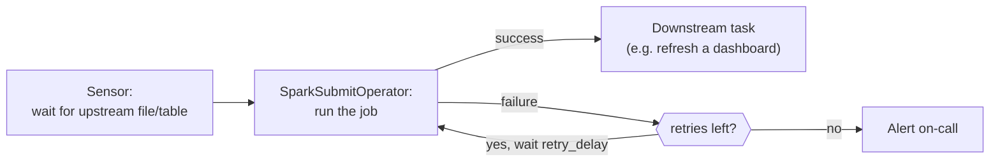

# Lesson 4 — Orchestration with Airflow

> **Honesty note:** the DAG code below is correct, real Airflow syntax — but it wasn't executed
> against a live Airflow install in this course's environment (Airflow's own dependency footprint
> is heavy enough that it doesn't belong in this course's shared venv). What **is** verified in this
> lesson is the underlying retry/backoff mechanism itself, run as a small standalone Python script —
> the same logic Airflow's `retries`/`retry_delay` implement under the hood.

A Spark job that only runs when someone remembers to type `spark-submit` isn't a production
pipeline. **Airflow** is the standard tool for scheduling Spark jobs, defining dependencies between
pipeline steps, and — critically — handling retries so a transient failure doesn't need a human to
notice and re-run it manually.



## A realistic DAG

```python
from airflow import DAG
from airflow.providers.apache.spark.operators.spark_submit import SparkSubmitOperator
from datetime import datetime, timedelta

default_args = {
    "retries": 3,
    "retry_delay": timedelta(minutes=5),
    "retry_exponential_backoff": True,
}

with DAG(
    dag_id="daily_orders_pipeline",
    schedule_interval="0 2 * * *",   # 2 AM daily
    start_date=datetime(2024, 1, 1),
    catchup=False,
    default_args=default_args,
) as dag:

    run_orders_job = SparkSubmitOperator(
        task_id="run_orders_job",
        application="/jobs/orders_pipeline.py",
        conf={"spark.sql.shuffle.partitions": "200"},
        application_args=["--load-date", "{{ ds }}"],   # Airflow's templated execution date
    )
```

## What each argument actually solves

- **`retries=3`, `retry_delay=timedelta(minutes=5)`**: a transient failure (a brief resource
  contention on the cluster, a momentary network blip talking to a source system) gets
  automatically retried instead of paging someone at 2 AM for something that would have succeeded
  on a second attempt. Module 12's idempotency lesson is exactly what makes automatic retries safe
  in the first place — retrying a non-idempotent job just automates the double-counting bug instead
  of preventing it.
- **`retry_exponential_backoff=True`**: each retry waits longer than the last, verified with a
  standalone simulation of the underlying pattern:

  ```
  attempt 1 failed, retrying in 1s...
  attempt 2 failed, retrying in 2s...
  attempt 3: job succeeded

  gaps between attempts: [1.0, 2.0]
  ```

  Verified: the delay genuinely doubled between attempts (`1s` → `2s`), not a fixed interval. The
  real value of exponential backoff is avoiding a "thundering herd" — if the underlying issue is a
  cluster genuinely under load, retrying instantly and repeatedly makes that load worse; backing
  off gives the underlying problem room to actually resolve.
- **`{{ ds }}` (a Jinja template)**: Airflow substitutes the DAG run's logical execution date here —
  this is how the *same* DAG definition processes a different day's data on each scheduled run,
  directly feeding Module 12's `replaceWhere`-based idempotent load pattern
  (`--load-date {{ ds }}` becomes the exact partition key a `replaceWhere` write scopes to).
- **`catchup=False`**: without this, Airflow would try to run every scheduled interval between
  `start_date` and now that hasn't run yet, all at once, the moment the DAG is turned on — rarely
  what you want for a new pipeline; `catchup=True` is the right choice specifically when you
  deliberately need historical backfill runs.

## Why retries alone aren't enough

A job that keeps failing and keeps retrying **forever** is its own incident — `retries=3` caps the
attempts, and Airflow's alerting (`on_failure_callback`, or a monitoring integration) is what
actually pages a human once the retries are exhausted. Retries handle the transient case; alerting
handles "this needs an actual human, the automation gave up."

## Best-practice callout

**Design every orchestrated job to be safely retryable before wiring up `retries` at all** — this
is Module 12's idempotency lesson made concrete: an Airflow retry is only a safety net if the
underlying job genuinely produces the same result whether it ran once or three times. Airflow
gives you the retry mechanism; your job has to earn the right to use it safely.

---
**Next:** [Lesson 5 — A Production Readiness Checklist](05-production-readiness-checklist.md)
