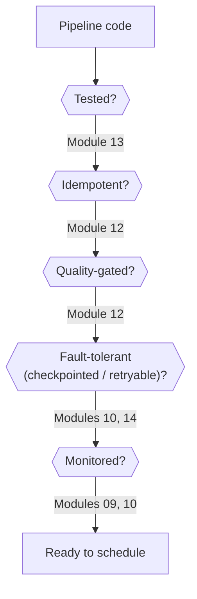

# Lesson 5 — A Production Readiness Checklist

This lesson doesn't introduce new mechanics — it assembles a checklist from tools this entire
course already built, as the "is this job actually ready to run unattended" review a real team
would do before a pipeline goes live. Every item links back to where it was actually verified.

## The checklist

**1. Is the transformation logic actually tested?** (Module 13)
- Pure, testable functions — DataFrame in, DataFrame out, no hardcoded paths.
- A `session`-scoped `SparkSession` fixture so the test suite runs fast enough to actually be run
  on every change, not skipped because it's slow.
- Edge cases covered explicitly — an empty batch, in particular, since a naive quality gate
  verified to trivially pass on one.

**2. Is the job idempotent?** (Module 12)
- Verified test: does running the same load twice produce the same result, or does it double-count?
- `replaceWhere`-scoped overwrites or `MERGE`-based upserts, not naive `append`, for anything a
  retry (Lesson 4) might genuinely re-run.

**3. Is there a data quality gate, and does it check volume as well as validity?** (Module 12,
Module 13 Lesson 4)
- Per-row checks (nulls, value ranges, referential integrity) AND a minimum-row-count check —
  verified that an empty batch trivially passes a gate built only from the former.
- Bad data provably never reaches the next layer — verified by checking the actual row count
  downstream, not just trusting a logged warning.

**4. Is the job fault-tolerant against its own restart?** (Module 10, Module 11)
- A real `checkpointLocation` for any streaming job, verified (Module 10) to survive a genuine
  process/JVM restart without reprocessing or duplicating already-committed data.
- Delta's transaction log (Module 11) giving you `MERGE`'s built-in upsert safety and `RESTORE` as
  a safe, auditable undo if a bad load does slip through.

**5. Is the job retryable, and does the retry policy make sense for this specific job?** (This
module, Lesson 4)
- `retries` + exponential `retry_delay`, verified as the correct escalating-wait mechanism —
  but only meaningful because item 2 (idempotency) is already true.
- A cap on retries, with real alerting once they're exhausted — a job that retries forever with no
  human ever notified is its own incident.

**6. Is the job monitored, and would you actually notice if it silently stopped making progress?**
(Module 09, Module 10)
- The Spark UI's Stages/Executors tabs (Module 09) for batch jobs — skew, GC time, task duration.
- `query.lastProgress`/`recentProgress` (Module 10) for streaming jobs — verified fields like
  `inputRowsPerSecond` vs `processedRowsPerSecond` as the concrete signal a stream is falling behind
  its source, not just "is the process still alive."

**7. Is cluster sizing reasoned about, not just defaulted?** (This module, Lessons 2-3)
- Executors/cores/memory sized from the actual hardware or platform tier, not copy-pasted from an
  unrelated job.
- Re-measured against real Spark UI GC/task-duration data once the job has actually run, not
  treated as a one-time calculation.

## Why this is a checklist, not a single gate

Unlike Module 12's quality gate (which deliberately raises before write), this list isn't something
code enforces automatically — it's a **review**, the kind a team does before a new pipeline ships
or during an incident retro when something got missed. Different organizations will weight these
differently (a low-stakes internal reporting job needs less rigor than a pipeline feeding a
customer-facing product), but every item on this list is a deliberate decision either way, not an
accident of what the first working version of the code happened to do.

## Best-practice callout

**Revisit this checklist after an incident, not just before launch.** The honest version of this
list, for a real pipeline that's been in production a while, usually has a story behind each item —
"we added the volume check after the day the batch silently loaded zero rows," "we added retries
after the third 2 AM page for a transient network blip." Building the list from first principles
before you've been burned is strictly better than learning each item the hard way, which is exactly
what this module (and this course) is trying to hand you for free.

---
Check the boxes in [`PROGRESS.md`](../PROGRESS.md), then: [`exercises/`](exercises/) before
[`solutions/`](solutions/), then [`quiz.md`](quiz.md).
